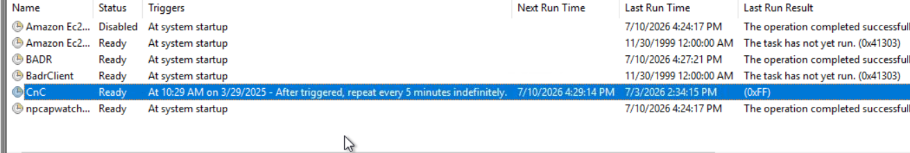
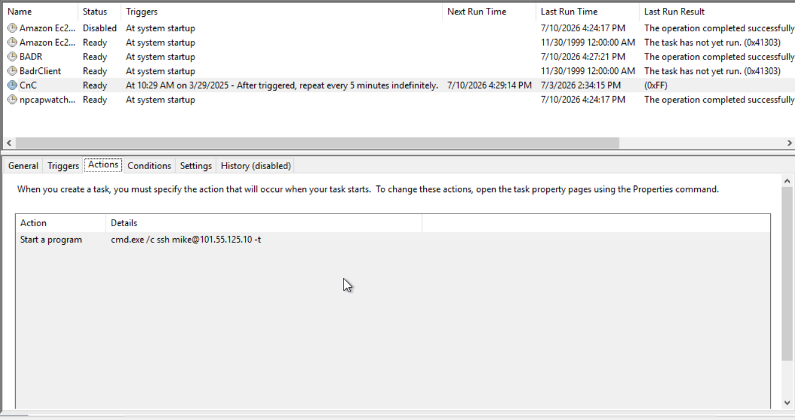
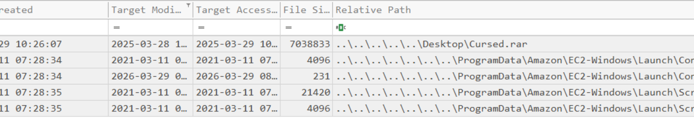
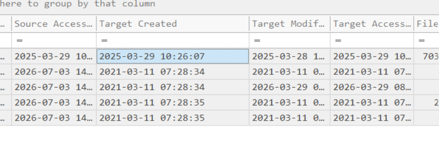
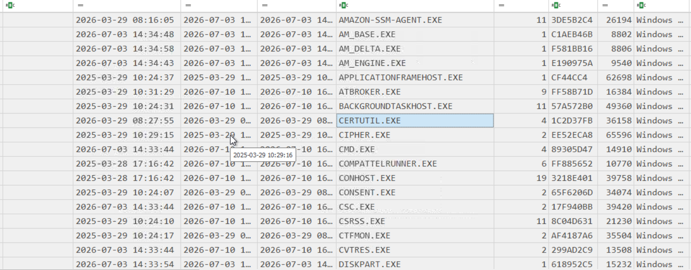
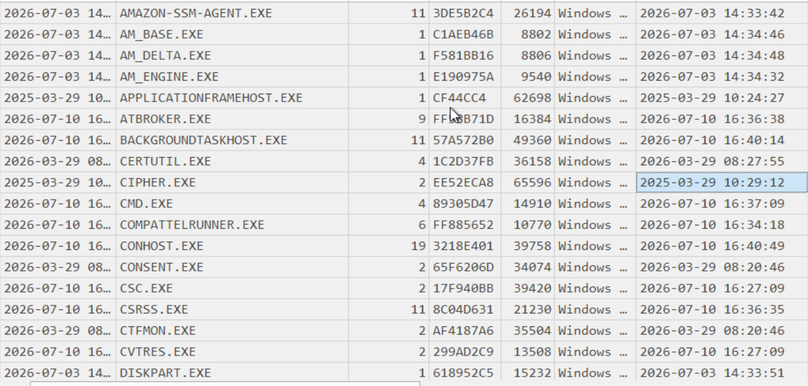
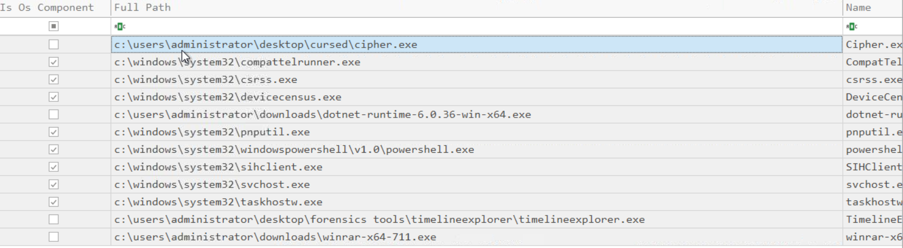
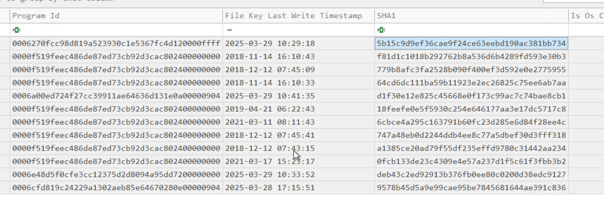
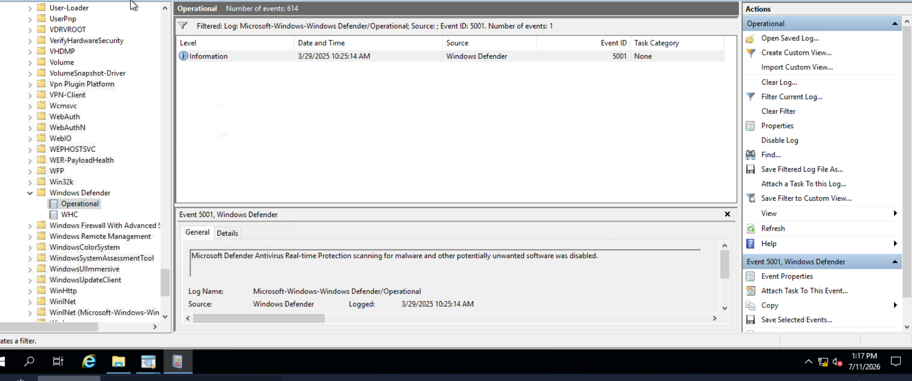
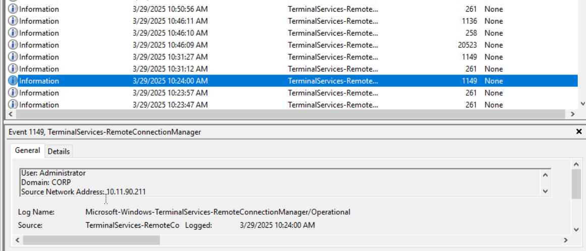

# Windows Compromise Analysis

## Scenario

You are a Security Analyst investigating a compromised Windows workstation suspected of malicious activity. During the investigation, several Windows forensic artifacts have been collected to determine how the attacker compromised the system, established persistence, and executed malware.

The objective is to analyze these forensic artifacts using **Eric Zimmerman's forensic tools** to reconstruct the attack timeline, identify attacker techniques, and recover indicators of compromise (IOCs).

Throughout this investigation, artifacts such as **Scheduled Tasks, LNK Files, Prefetch Files, Amcache, and Windows Event Logs** will be analyzed to reveal the attacker's activities.


# Task 3 – Timeline Explorer

## Overview

Timeline Explorer is a forensic analysis tool developed by **Eric Zimmerman** for viewing and analyzing CSV files generated by forensic parsing tools. Instead of manually reviewing large CSV datasets in Excel, Timeline Explorer provides filtering, sorting, grouping, and timeline capabilities that significantly improve forensic investigations.

During this room, Timeline Explorer is used to analyze the CSV output generated by multiple forensic utilities.

---

## Question 1

### Question

```text
Which tool makes it easier to analyze CSV files?
```

### Investigation

Several forensic tools used throughout this investigation export their results in CSV format. Timeline Explorer provides a simple interface for filtering, sorting, and reviewing these artifacts, making it much easier to locate suspicious events.

### Answer

```text
Timeline Explorer
```

---

# Task 4 – Scheduled Tasks

## Overview

Windows Task Scheduler allows users and applications to automate the execution of programs at predefined times or events. While this is a legitimate administrative feature, threat actors frequently abuse Scheduled Tasks to establish persistence, ensuring malicious programs execute automatically after system startup or at scheduled intervals.

As part of this investigation, the Scheduled Task artifacts were reviewed to identify attacker-created persistence mechanisms.

---

## Question 1

### Question

```text
What is the name of the scheduled task created by the attacker?
```

### Investigation

The Task Scheduler configuration was examined to identify newly created or suspicious scheduled tasks. During the review, one task was found that did not match legitimate system activity and appeared to execute attacker-controlled software.


### Answer

```text
CnC
```

### Evidence



---

## Question 2

### Question

```text
What is the IP of the malicious server to which SSH requests are made?
```

### Investigation

After identifying the malicious scheduled task, its configuration and associated network activity were analyzed. The scheduled task initiated SSH communication with a remote server controlled by the attacker.


### Answer

```text
101.55.125.10
```

### Evidence



---

# Task 5 – LNK Files

## Overview

LNK (Shortcut) files are Windows shortcut files that store metadata about files recently opened or accessed by a user. Although their primary purpose is user convenience, they are extremely valuable during forensic investigations because they record timestamps, file locations, and execution information.

Threat actors often rely on archives such as ZIP or RAR files to deliver malware. By examining LNK files, investigators can identify when these archives were accessed and correlate them with malware execution.

To analyze the shortcuts, **LECmd**, another forensic tool developed by Eric Zimmerman, was used to parse the Recent Items directory.

Command used:

```powershell
.\LECmd.exe -d C:\Users\Administrator\AppData\Roaming\Microsoft\Windows\Recent --csvf Parsed-LNK.csv --csv C:\Users\Administrator\Desktop
```

The resulting CSV file was opened in Timeline Explorer to review recently accessed files.

---

## Question 1

### Question

```text
What is the name of the RAR file created during the attack?
```

### Investigation

The parsed LNK artifacts revealed that shortly before the malicious scheduled task was created, a compressed archive had been accessed.

This archive likely served as the delivery mechanism for the malware executed later in the attack chain.

### Answer

```text
Cursed.rar
```

### Evidence



---

## Question 2

### Question

```text
When was the RAR file created in the system? Format YYYY-MM-DD HH:MM:SS
```

### Investigation

Reviewing the timestamps associated with the LNK artifact showed the archive's creation time.

Correlating this timestamp with the Scheduled Task timeline demonstrated that the archive appeared on the system approximately two minutes before the persistence mechanism was established.

This relationship strongly suggests the archive contained the malicious payload executed later in the investigation.

### Answer

```text
2025-03-29 10:26:07
```

### Evidence



---

# Task 6 – Prefetch Files

## Overview

Windows Prefetch is a performance optimization feature that records information about executable files that have been run on the system. Each Prefetch file contains valuable forensic metadata such as:

- Executable name
- Number of executions
- Last execution time
- DLL dependencies
- Files accessed during execution

From a forensic perspective, Prefetch files are extremely useful because they provide strong evidence that an application was actually executed, even if the executable has since been deleted.

For this task, **PECmd**, developed by Eric Zimmerman, was used to parse the Prefetch files.

Command used:

```powershell
.\PECmd.exe -d C:\Windows\Prefetch --csv C:\Users\Administrator\Desktop
```

The generated CSV was then opened using Timeline Explorer for analysis.

---

## Question 1

### Question

```text
What malicious executable was launched from the extracted archive?
```

### Investigation

After reviewing the Prefetch entries, one executable clearly stood out as suspicious. It appeared immediately after the malicious archive was accessed and had no association with legitimate Windows applications.

The Prefetch entry confirmed that the executable had successfully run on the compromised system.

### Answer

```text
Cipher.exe
```

### Evidence



---

## Question 2

### Question

```text
How many times was the malicious executable executed?
```

### Investigation

The Prefetch metadata records the execution count for every application.

Reviewing the execution count of the malicious executable confirmed that it had only been launched once before the attacker established persistence.

### Answer

```text
2
```

### Evidence



---

## Question 3

### Question

```text
When was the executable last executed?
```

### Investigation

The "Last Run Time" field within the Prefetch artifact identifies the most recent execution of the application.

This timestamp helps correlate malware execution with other forensic artifacts such as Scheduled Tasks and Windows Event Logs.

### Answer

```text
2025-03-29 10:29:12
```

### Evidence


---

# Task 7 – Amcache

## Overview

The **Amcache Hive** is one of the most valuable Windows forensic artifacts for malware investigations.

Windows automatically records metadata about executables that have been run on the system. Unlike Prefetch, Amcache retains information even if the executable has been deleted.

Information stored includes:

- SHA1 hash
- File path
- Compile timestamp
- Publisher
- Product name
- File size
- First execution

Eric Zimmerman's **AmcacheParser** was used to examine the artifact.

Command used:

```
.\AmcacheParser.exe -f Amcache.hve --csv C:\Users\Administrator\Desktop
```

---

## Question 1

### Question

```text
What is the full path of the malicious file?
```

### Investigation
The file path is found using the executable name discovered above.

### Answer

```text
c:\users\administrator\desktop\cursed\cipher.exe
```

### Evidence



---
## Question 2

### Question

```text
What is the SHA1 hash of the malicious executable?
```

### Investigation

The Amcache database was searched for the previously identified executable.

Its metadata included the complete SHA1 hash, allowing analysts to correlate the malware with external threat intelligence sources.

### Answer

```text
5b15c9d9ef36cae9f24ce63eebd190ac381bb734
```

### Evidence



---


# Task 8 – Windows Event Logs

## Overview

Windows Event Logs record nearly every significant activity occurring on a Windows system.

For incident response, Security Event Logs are especially valuable because they capture:

- User logons
- RDP connections
- Process creation
- Account changes
- Service installation
- Security configuration changes

The Event Logs were parsed using Eric Zimmerman's **EvtxECmd**.

Command used:

```powershell
.\EvtxECmd.exe -d SecurityLogs --csv C:\Users\Administrator\Desktop
```

---

## Question 1

### Question

```text
Which IP address established the Remote Desktop session?
```

### Investigation

Successful Remote Desktop logons were identified within the Security Event Log.

The Source Network Address field recorded the remote host used by the attacker to access the workstation.

### Answer

```text
10.11.90.211
```

### Evidence



---

## Question 2

### Question

```text
Which account was used during the RDP login?
```

### Investigation

The successful logon event identified the account used by the attacker to establish the remote session.

This information helps determine whether compromised credentials or newly created accounts were used.

### Answer

```text
Administrator
```

### Evidence



---

# Attack Timeline

| Time | Event | MITRE ATT&CK |
|------|-------|--------------|
| **2025-03-29 10:26:07** | A compressed archive named **Cursed.rar** was created on the system, likely containing the attacker's payload. | **T1204.002 – User Execution: Malicious File** |
| **Shortly after** | The archive was accessed and the malicious executable **Cipher.exe** was extracted and executed. | **T1204.002 – User Execution: Malicious File** |
| **2025-03-29 10:29:12** | Prefetch artifacts confirmed that **Cipher.exe** was successfully executed on the host. | **T1059 – Command and Scripting Interpreter** |
| **Following execution** | Windows Defender protections were disabled to allow malware execution without interference. | **T1562.001 – Impair Defenses: Disable or Modify Security Tools** |
| **Immediately after** | A malicious Scheduled Task named **CnC** was created to maintain persistence across system reboots. | **T1053.005 – Scheduled Task/Job** |
| **Persistence Stage** | The Scheduled Task initiated outbound SSH communication with **101.55.125.10**, establishing communication with the attacker's infrastructure. | **T1021.004 – SSH**<br>**T1071 – Application Layer Protocol** |
| **Execution Analysis** | Amcache recorded metadata including the SHA1 hash of **Cipher.exe**, confirming execution even if the binary was later removed. | **T1105 – Ingress Tool Transfer** |
| **Remote Access** | Windows Security Event Logs identified a successful Remote Desktop session originating from **10.11.90.211**. | **T1021.001 – Remote Desktop Protocol (RDP)** |
| **Post-Compromise** | Multiple forensic artifacts (LNK, Prefetch, Amcache, Event Logs, and Scheduled Tasks) were correlated to reconstruct the complete attack chain. | **TA0005 – Defense Evasion**<br>**TA0003 – Persistence** |

---


# Attack Flow

```text
Initial Access
      │
      ▼
User downloads Cursed.rar
(T1204.002)
      │
      ▼
Cipher.exe extracted & executed
(T1204.002)
      │
      ▼
Windows Defender Disabled
(T1562.001)
      │
      ▼
CnC Scheduled Task Created
(T1053.005)
      │
      ▼
SSH Connection to
101.55.125.10
(T1021.004)
      │
      ▼
Persistence Established
      │
      ▼
Remote Access Observed
(RDP - T1021.001)
```


