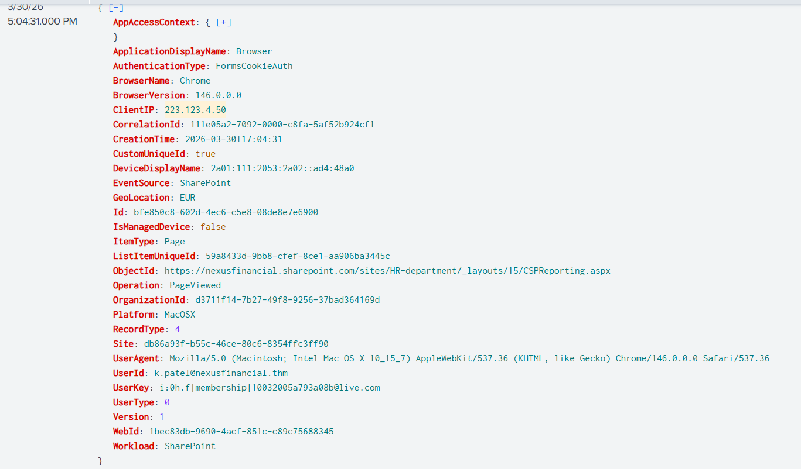
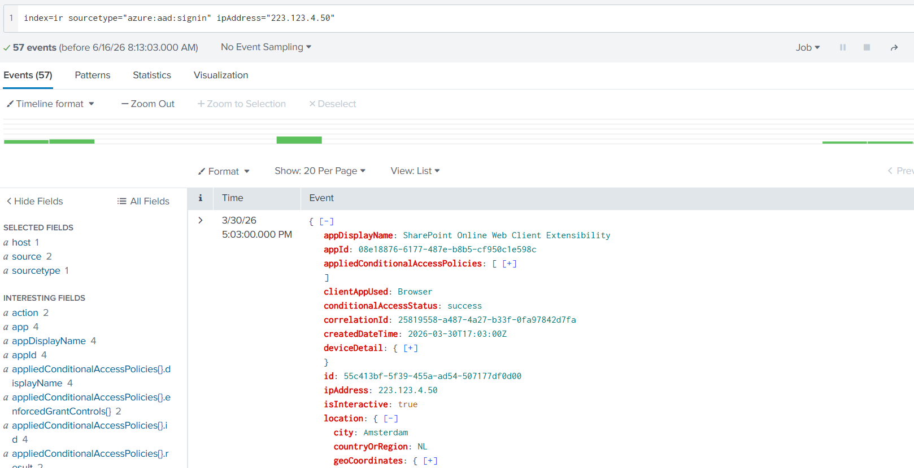
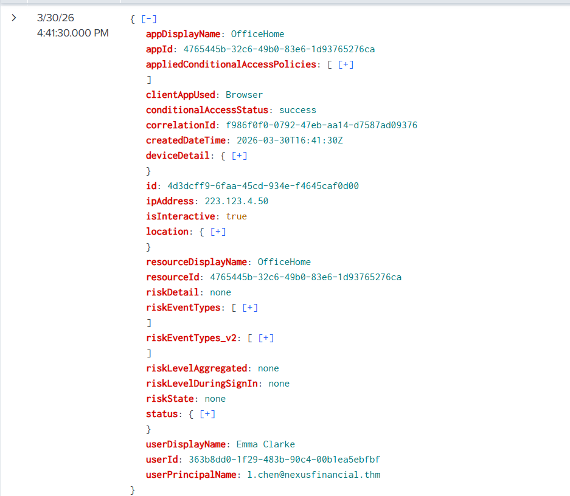
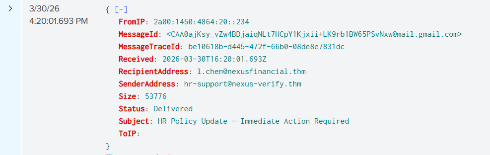
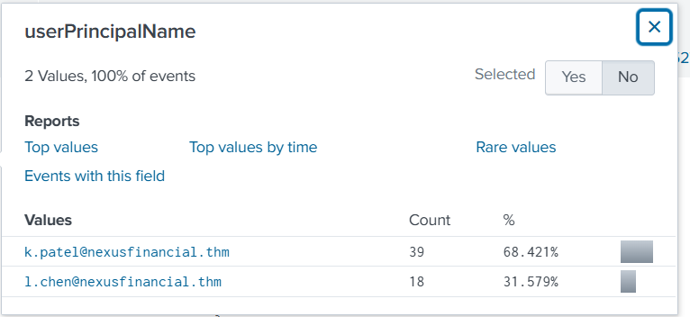
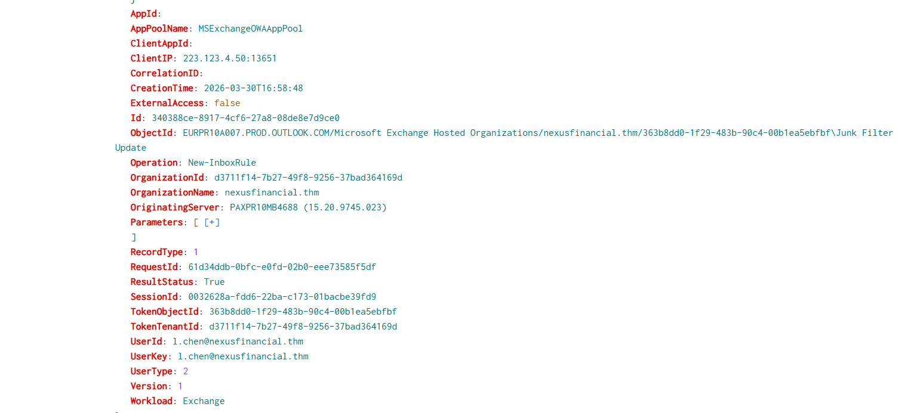
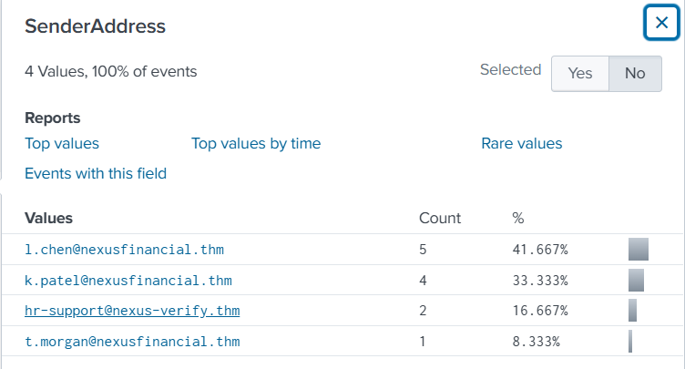

# Incident Response: Detection and Analysis

## Scenario

According to NIST SP 800-61 Rev. 2, Detection and Analysis is the phase where Incident Responders determine whether a security incident has occurred and develop a complete understanding of the event.

Detection confirms that an incident is real, while Analysis focuses on understanding how the incident occurred, what systems were affected, and the potential impact on the organization.

In this room, Nexus Financial experiences suspicious activity that requires investigation. As an Incident Responder, the objective is to validate alerts, analyze evidence, identify Indicators of Compromise (IOCs), and determine the scope of the incident.

---

## Detection

Detection is the process of confirming whether a reported event represents a legitimate security incident.

Potential incidents can be identified through:

* SIEM alerts
* User reports
* EDR detections
* Threat intelligence feeds
* Third-party notifications

Not every alert is malicious. The first responsibility of the analyst is to determine whether the alert is a:

* True Positive
* False Positive

At Nexus Financial, alerts are initially reviewed by an L1 Analyst who performs triage and escalation. Once escalated, the L2 Analyst validates the findings and performs a deeper investigation.

---

## Analysis

After confirming an incident, analysts begin the analysis phase.

The goal is to answer critical questions such as:

* How did the attacker gain access?
* Which systems were affected?
* Which accounts were compromised?
* What actions were performed?
* Was any sensitive data accessed or exfiltrated?

Analysis involves correlating information from multiple log sources and reconstructing the attack timeline.

---

## Scoping

Scoping is a critical part of analysis and focuses on identifying:

* All affected accounts
* Compromised devices
* Malicious IP addresses
* Indicators of Compromise (IOCs)
* Potentially exposed data

A complete scope ensures that containment and remediation activities are effective.

---

## Common Incident Response Triggers

| Trigger Source           | Example                                         |
| ------------------------ | ----------------------------------------------- |
| SOC Alert Escalation     | SIEM detects suspicious authentication activity |
| User Report              | Employee reports suspicious email activity      |
| Automated Detection      | EDR identifies malicious process execution      |
| Third-Party Notification | External organization reports a compromise      |
| Threat Intelligence Feed | IOC matches organization infrastructure         |

---

## Team Communication During Incident Response

Effective communication is critical during an active investigation.

Common communication challenges include:

* Delayed escalation
* Outdated contact information
* Limited access to logs
* Slow responses from third-party providers
* Lack of documented communication

Proper communication ensures that investigations progress efficiently and evidence is preserved.

---

## Investigation Resources

### Asset Inventory

The Asset Inventory serves as a reference document that contains:

* Servers
* Workstations
* Network devices
* Cloud platforms
* Business applications

This information helps investigators identify affected assets during an incident.

### IOC Tracker

The IOC Tracker maintains a record of every Indicator of Compromise discovered during the investigation.

Each IOC entry typically contains:

* IOC Type
* IOC Value
* Source
* Investigation Notes

The IOC Tracker evolves throughout the investigation as new evidence is discovered.

---
# Case Overview

## Scenario

Nexus Financial's SIEM generated a high-severity alert for a successful sign-in to an employee account from an IP address that had never previously been observed within the organization's environment.

### Alert Details

- **Alert Name:** Anomalous Sign-in Detected
- **Timestamp:** 2026-03-30 16:41:30
- **Affected Account:** l.chen@nexusfinancial.thm
- **Corporate IP:** 197.32.45.112
- **Severity:** High

### Escalation Details

- **Ticket ID:** NXF-SOC-2026-0312
- **Raised By:** Marcus Webb (Security Analyst - L1)
- **Assigned To:** IR Analyst (L2)

Initial triage determined that the sign-in originated from outside the United Kingdom and was inconsistent with the user's normal behavior. Laura Chen, the affected employee, confirmed that she did not perform the authentication activity.

As the assigned Incident Response Analyst, the objective is to validate the alert, investigate the source of the authentication attempt, identify any associated Indicators of Compromise (IOCs), and determine whether the account has been compromised.

# Practical Investigation
## Detection Practical

## Question 1

### What was the IP address from which these suspicious sign-in events originated?

**Answer:** `223.123.4.50`



The authentication logs revealed that the suspicious sign-in activity originated from this IP address.

---

## Question 2

### What city did the suspicious sign-in originate from?

**Answer:** `Amsterdam`



Since, it is mentioned that all corporate work takes place in London, any other location is suspicious.

## Question 3

### What was the exact timestamp of the first suspicious sign-in on Laura Chen's account?

**Answer:** `2026-03-30 16:41:30`

`index=ir sourcetype="azure:aad:signin" ipAddress="223.123.4.50" user_id="l.chen@nexusfinancial.thm" "status.errorCode"=0`



The first suspicious authentication event occurred at this timestamp.

---

## Question 4

### What was the subject line of the email delivered to Laura Chen before the suspicious sign-in?

**Answer:** `HR Policy Update — Immediate Action Required`

`index=ir sourcetype="o365:reporting:messagetrace" RecipientAddress="l.chen@nexusfinancial.thm"`
Check the emails before the timestamp in the question 3. 


The phishing email used an urgent subject line to encourage immediate action.

---

## Question 5

### What was the sender domain of the phishing email?

**Answer:** `nexus-verify.thm`


The sender domain was identified as a malicious domain impersonating a legitimate service.

---

## Analysis Practical

### Question 1

#### How many Nexus Financial accounts show sign-in activity from the attacker's IP?

**Answer:** `2`

`index=ir sourcetype="azure:aad:signin" ipAddress="223.123.4.50"`

Investigation of the authentication logs revealed that two Nexus Financial accounts showed sign-in activity originating from the attacker's IP address.



---

### Question 2

#### What is the email address of the second compromised account?

**Answer:** `k.patel@nexusfinancial.thm`

Analysis of additional sign-in events identified a second compromised user account associated with the same attacker infrastructure.


---

### Question 3

#### What is the name of the inbox rule created on Laura Chen's account?

**Answer:** `Junk Filter Update`

`index=ir sourcetype="o365:management:activity" UserId="l.chen@nexusfinancial.thm" Operation="New-InboxRule"`

Mailbox audit logs revealed that the attacker created an inbox rule named **Junk Filter Update**, likely to hide future phishing or security-related emails from the victim.



---

### Question 4

#### How many Nexus Financial employee accounts received the initial phishing email?

**Answer:** `2`

Email trace analysis showed that the phishing message was delivered to two employee accounts within the organization.



---

# Indicators of Compromise (IOCs)

## IP Address

```text
223.123.4.50
```

## Malicious Domain

```text
nexus-verify.thm
```

## Compromised Accounts

```text
l.chen@nexusfinancial.thm
k.patel@nexusfinancial.thm
```

## Targeted User

```text
Laura Chen
```

## Malicious Inbox Rule

```text
Junk Filter Update
```

## Phishing Email Subject

```text
HR Policy Update — Immediate Action Required
```

---

# Summary

The investigation began with a high-severity SIEM alert indicating a successful sign-in from an unfamiliar IP address. Analysis revealed that the activity originated from **223.123.4.50** in **Amsterdam** and targeted **Laura Chen's** account shortly after she received a phishing email from **nexus-verify.thm**.

Further investigation identified a second compromised account, **[k.patel@nexusfinancial.thm](mailto:k.patel@nexusfinancial.thm)**, which also showed sign-in activity from the same attacker IP. Mailbox audit logs revealed the creation of an inbox rule named **Junk Filter Update**, likely intended to conceal attacker activity. Email trace analysis confirmed that the phishing campaign targeted two employees, demonstrating that the incident extended beyond a single account compromise.

The collected evidence confirmed a phishing-based compromise and established the attacker's infrastructure, affected users, and techniques used to maintain access.


---


