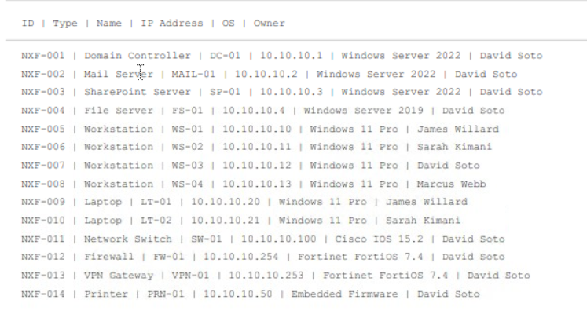
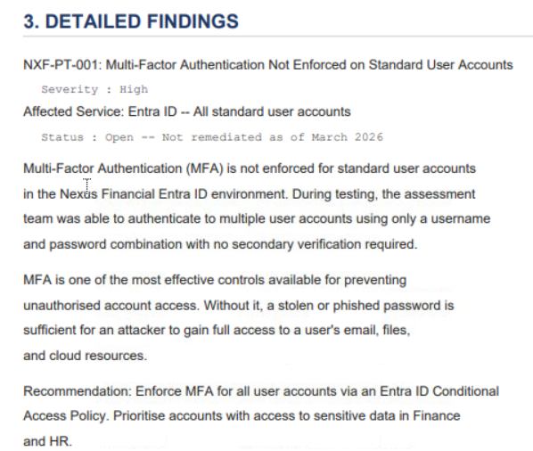
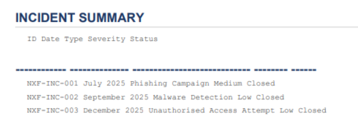
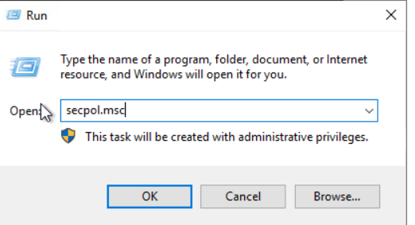
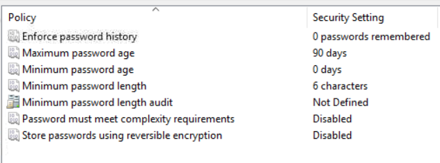
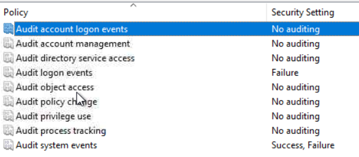

# Incident Response: Preparation

## Scenario

This room introduces the fundamentals of Incident Response (IR) through a case study involving **Nexus Financial**. The objective is to understand how organizations prepare for security incidents, identify weaknesses in their security posture, and assess their readiness to respond to cyber threats.

Incident Response is the structured process organizations use to prepare for, detect, analyze, contain, eradicate, and recover from cybersecurity incidents while minimizing business impact and reducing recovery time.

Organizations face cyber threats daily, making it essential to have effective people, processes, and technology in place before an incident occurs.

---

## What Triggers an Incident Response?

An Incident Response process can be initiated through various sources, including:

* Security alerts escalated by SOC analysts
* User reports of suspicious emails or account activity
* Automated detections from SIEM or EDR solutions
* Threat intelligence notifications
* Reports from third parties such as customers, partners, or law enforcement

The ability to quickly identify and escalate these events is critical to minimizing the impact of an attack.

---

## Incident Response Framework

One of the most widely adopted frameworks is the **NIST SP 800-61 Computer Security Incident Handling Guide**, which defines four phases of Incident Response:

### 1. Preparation

Establishing policies, procedures, personnel, and technology required for incident handling.

### 2. Detection and Analysis

Identifying suspicious activity, validating alerts, and determining the scope of an incident.

### 3. Containment, Eradication, and Recovery

Stopping attacker activity, removing malicious artifacts, and restoring affected systems.

### 4. Post-Incident Activity

Conducting lessons learned reviews and implementing improvements to prevent recurrence.

---

## People, Processes, and Technology

### People

The team responsible for managing security incidents is known as the **Cyber Security Incident Response Team (CSIRT)**.

Responsibilities include:

* Monitoring security alerts
* Investigating incidents
* Collecting evidence
* Coordinating response efforts
* Communicating with stakeholders

CSIRT members should be trained in:

* Log analysis
* Digital forensics
* Threat hunting
* Malware analysis
* Incident handling procedures

### Processes

Documented procedures ensure consistency and efficiency during investigations.

Examples include:

* Incident classification
* Escalation procedures
* Communication plans
* Evidence handling
* Reporting requirements

### Technology

Technology provides visibility and detection capabilities.

Common tools include:

* SIEM platforms
* EDR solutions
* Firewalls
* IDS/IPS systems
* Threat Intelligence Platforms
* Forensic tools

---

## Visibility and Detection

Visibility refers to the ability to observe activity across the environment through monitoring and log collection.

Detection refers to the ability to identify malicious activity from collected data.

Both are essential because a lack of either creates opportunities for attackers to remain undetected.

### Types of Log Entries

#### Event Logs

Record system activities such as:

* Login attempts
* Network connections
* Application events

#### Audit Logs

Track:

* Who performed an action
* What action occurred
* Whether the action succeeded or failed

#### Error Logs

Record application crashes and service failures.

#### Debug Logs

Contain detailed diagnostic information for troubleshooting.

### Types of Log Sources

#### Network Logs

Generated by routers, switches, and firewalls.

#### Host Perimeter Logs

Generated by proxies, VPN servers, and boundary firewalls.

#### System Logs

Generated by operating systems on servers and workstations.

#### Application Logs

Generated by business applications, cloud services, databases, Microsoft 365, Exchange Online, SharePoint, and Entra ID.

---

## Detection Gaps

A detection gap occurs when logs are collected but no monitoring rules exist to identify suspicious behavior.

This can result in:

* Delayed incident discovery
* Extended attacker dwell time
* Increased business impact
* Reduced visibility during investigations

The Nexus Financial case study demonstrates how detection gaps can allow attacker activity to go unnoticed despite evidence existing within logs.

---

## Nexus Financial Case Study

Nexus Financial has implemented an Incident Response program based on the NIST SP 800-61 framework.

The organization maintains:

* A Cyber Security Incident Response Team (CSIRT)
* An Incident Response Policy
* A Communication Plan
* A SIEM platform

SOC Engineers are responsible for collecting logs and building detection rules, while SOC Analysts investigate alerts and coordinate response activities.

Although the organization has established these foundations, several critical security weaknesses remain unresolved.

### Identified Security Gaps

* Missing Multi-Factor Authentication (MFA) on standard user accounts
* Missing email authentication controls
* Weak password policies
* Inadequate auditing configurations
* Previous phishing incidents that were not fully remediated

These weaknesses ultimately contribute to future security incidents.

---

# Practical Investigation
## Open the Nexus folder

## Question 1

**According to the asset inventory, what is the IP address of the mail server?**

**Answer:** `10.10.10.2`

---

## Question 2

**According to the pentest report, what authentication control is flagged as missing on standard user accounts?**

**Answer:** `Multi-Factor Authentication`

---

## Question 3

**According to the pentest report, how many high-severity findings were identified?**

**Answer:** `2`

---

## Question 4

**According to the historic incidents log, what type of attack was recorded in NXF-INC-001?**

**Answer:** `Phishing Campaign`

# Open the Run dialog box. Type secpol.msc

## Question 5

**What is the minimum password length configured on this workstation?**

**Answer:** `6`

---

## Question 6

**What is the audit setting configured for Audit Account Logon Events?**

**Answer:** `No Auditing`

---

## Lessons Learned

* Incident Response begins long before an incident occurs.
* Effective preparation requires skilled personnel, documented procedures, and appropriate security technologies.
* Multi-Factor Authentication significantly reduces the risk of account compromise.
* Logging and auditing provide critical visibility during investigations.
* Security findings must be remediated promptly to prevent future incidents.
* Detection gaps can allow attackers to operate undetected despite evidence existing in logs.

---

## Conclusion

This room demonstrated the importance of the Preparation phase within the Incident Response lifecycle. Through the Nexus Financial case study, several weaknesses were identified, including missing MFA, weak password policies, inadequate auditing, and unresolved phishing-related issues.

The exercise highlights how seemingly minor security gaps can create opportunities for attackers and emphasizes the need for continuous improvement in people, processes, and technology. Effective preparation remains the foundation of every successful Incident Response capability.
