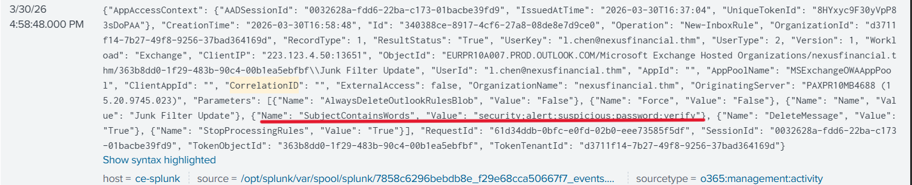
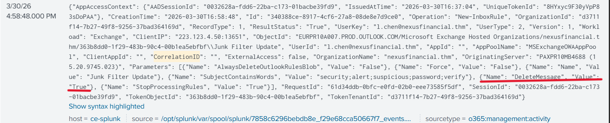

# Incident Response – Containment, Eradication & Recovery

## Introduction

Once a security incident has been confirmed, the investigation phase ends and the response phase begins. This is the stage where the Incident Response (IR) team transitions from observation to action. According to NIST SP 800-61 Rev.2, the response phase consists of three critical activities that must be executed in sequence:

| Phase | Goal |
|---------|---------|
| Containment | Stop the damage from spreading further |
| Eradication | Remove all attacker presence from the environment |
| Recovery | Restore normal operations safely |

A common mistake during incident response is moving directly to eradication before containment is complete or restoring systems before the attacker has been fully removed. Both situations can result in the attacker regaining access and continuing their activities.

---

## Environment Matters

The actions taken during containment, eradication, and recovery depend heavily on the environment affected by the incident.

For example:

- An on-premises Active Directory compromise requires different actions than a cloud identity compromise.
- A compromised endpoint requires different response actions than a compromised Microsoft 365 account.
- Cloud incidents often involve identity management, email security, and access control reviews rather than system isolation.

Organizations use Incident Response Playbooks to ensure a structured and consistent response. Playbooks provide predefined procedures tailored to specific attack scenarios, reducing response time and improving effectiveness.

---

## Containment

Containment is the first action performed after an incident has been confirmed. Its purpose is to limit the attacker's ability to cause additional damage while preserving evidence for further investigation.

### Containment Strategies

#### Full Isolation

Full isolation completely removes attacker access by:

- Disabling compromised accounts
- Terminating active sessions
- Blocking malicious IP addresses
- Disconnecting affected systems

This method quickly stops attacker activity but may alert the attacker that they have been discovered.

#### Controlled Isolation

Controlled isolation limits attacker actions while allowing investigators to continue gathering intelligence.

Examples include:

- Monitoring attacker behavior
- Restricting permissions
- Limiting access to critical resources
- Collecting additional evidence

This approach provides valuable intelligence but carries the risk that the attacker remains active during the monitoring period.

---

## MITRE ATT&CK and Containment Decisions

MITRE ATT&CK is a framework that documents the tactics, techniques, and procedures (TTPs) used by real-world threat actors.

Mapping attacker activity to ATT&CK techniques helps analysts:

- Understand attacker objectives
- Identify persistence mechanisms
- Anticipate future actions
- Prioritize containment efforts

---

## Eradication

Once containment has successfully stopped the attacker's activity, eradication begins.

The goal of eradication is to remove every trace of the attacker from the environment.

Examples include:

- Removing malicious inbox rules
- Revoking OAuth permissions
- Removing persistence mechanisms
- Revoking malicious sharing links
- Investigating additional compromised accounts

---

## Recovery

Recovery focuses on safely restoring normal operations.

Before restoring access, analysts must verify:

- The attacker no longer has access
- All persistence mechanisms have been removed
- Security controls have been strengthened
- Monitoring systems are functioning correctly

Recovery also includes addressing the root cause of the incident to prevent future compromise.

Examples include:

- Enforcing Multi-Factor Authentication (MFA)
- Updating Conditional Access policies
- Reviewing sharing permissions
- Enhancing security monitoring

---

# Task 3 – Containment Practical

## Question 1

### Question

```text
What keywords does the malicious inbox rule on Laura Chen's account filter for? (Answer in the same format as inside the log)
```

### Investigation

`index=ir Operation=New-InboxRule`

### Answer

```text
security;alert;suspicious;password;verify
```

### Evidence



---

## Question 2

### Question

```text
What is the value of the DeleteMessage field in the malicious inbox rule on Laura Chen's account?
```

### Investigation

`index=ir Operation=New-InboxRule`
### Answer

```text
True
```

### Evidence



---

## Question 3

### Question

```text
What is the name of the inbox rule created on the second compromised account?
```

### Investigation

`index=ir Operation=New-InboxRule user_id="k.patel@nexusfinancial.thm"`

### Answer

```text
Security Updates
```

### Evidence


---

## Question 4

### Question

```text
Based on Task 3, what containment action should be taken against these inbox rules?
```

### Investigation

Malicious inbox rules allow attackers to hide security notifications and maintain persistence. Immediate removal is required to restore visibility and prevent continued abuse.

### Answer

```text
Remove the malicious inbox rules immediately
```

---

## Question 5

### Question

```text
How many internal Nexus Financial employees received the internal phishing email?
```

### Investigation

`index=ir sourcetype="o365:reporting:messagetrace" subject="HR Policy Update — Immediate Action Required" SenderAddress!="hr-support@nexus-verify.thm"`

### Answer

```text
3
```

### Evidence


---

## Question 6

### Question

```text
Based on Task 3, what containment action should be taken against the phishing domain?
```

### Investigation

The phishing domain was actively being used to deliver malicious emails. Blocking the domain prevents future phishing attempts from reaching users.

### Answer

```text
Block phishing domain at the email gateway
```
---

# Task 4 – Eradication & Recovery Practical

## Question 1

### Question

```text
How many files were downloaded from SharePoint across both compromised accounts?
```

### Investigation

SharePoint audit logs were reviewed to determine the scope of data access and identify files downloaded by the attacker.

### Answer

```text
5
```

### Evidence


---

## Question 2

### Question

```text
What is the name of the first file downloaded by the attacker from Laura Chen's account?
```

### Investigation

File access events within SharePoint showed the sequence of documents accessed and downloaded by the attacker.

### Answer

```text
Board_Meeting_Notes_July.docx
```

### Evidence


---

## Question 3

### Question

```text
Based on Task 4, what eradication action should be taken against the external sharing links created by the attacker?
```

### Investigation

The attacker created unauthorized SharePoint sharing links that could allow continued access to company data even after account remediation.

### Answer

```text
Revoking all external sharing links created by the attacker from SharePoint
```

### Evidence


---

## Question 4

### Question

```text
What risk level was assigned to the attacker's sign-ins by Microsoft's risk engine?
```

### Investigation

Microsoft Entra ID sign-in logs were reviewed to determine how the authentication events were classified by Microsoft's risk detection system.

### Answer

```text
none
```

### Evidence


---

## Question 5

### Question

```text
What authentication control was absent that allowed the attacker to sign in without additional verification? (Please input the abbreviation of the term)
```

### Investigation

The compromised accounts lacked an additional authentication factor, allowing the attacker to authenticate successfully using stolen credentials alone.

### Answer

```text
mfa
```

### Evidence


---

## Question 6

### Question

```text
According to the recovery timeframes in Task 4, what timeframe should MFA enforcement fall under?
```

### Investigation

As part of recovery planning, implementing MFA was identified as a near-term priority to reduce the risk of future account compromise.

### Answer

```text
Near term
```

### Evidence


---

# MITRE ATT&CK Mapping

| Technique | Description |
|------------|-------------|
| T1114.003 | Email Collection via Mailbox Rules |
| T1566.001 | Phishing |
| T1078 | Valid Accounts |
| T1098 | Account Manipulation |
| T1537 | Transfer Data to Cloud Account |

---

# Key Takeaways

- Containment focuses on preventing further damage while preserving evidence.
- Malicious inbox rules are commonly used to hide security alerts and maintain persistence.
- Internal phishing campaigns can originate from compromised user accounts.
- Unauthorized SharePoint sharing links may be abused for data exfiltration.
- MFA remains one of the most effective controls against credential-based attacks.
- Recovery should address both attacker removal and the root causes that enabled the compromise.

---

# Conclusion

This room demonstrated the final stages of the Incident Response lifecycle. During containment, malicious inbox rules were identified and phishing infrastructure was blocked to prevent further damage. During eradication, attacker-created SharePoint sharing links and persistence mechanisms were removed. Finally, recovery focused on strengthening identity security controls, particularly through MFA enforcement, to reduce the likelihood of future compromise.
