# Linux Compromise Assessment

## Scenario

A threat intelligence report revealed that the advanced threat group **IronShade** has been actively targeting Linux servers across the region. To better understand their tactics, techniques, and procedures (TTPs), the security team deployed a honeypot server with intentionally weak SSH credentials and exposed services.

The server was eventually compromised by the threat actor and has now been handed over for forensic investigation. Previous intelligence reports indicate that IronShade commonly establishes persistence by creating unauthorized backdoor accounts after gaining access to a target system.

As a Security Analyst, the objective is to perform a comprehensive compromise assessment of the Linux server and identify all evidence of attacker activity.

---

## Challenge

Investigate the compromised Linux server and identify the attacker's footprints left behind after exploitation. This includes discovering persistence mechanisms, malicious processes, suspicious services, authentication activity, and indicators of compromise that can help reconstruct the attack timeline.

---

# Question 1

### Question

```text
What is the Machine ID of the machine we are investigating?
```

### Investigation

`hostnamectl`

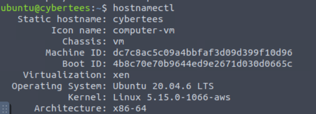

### Answer

```text
dc7c8ac5c09a4bbfaf3d09d399f10d96
```

---

# Question 2

### Question

```text
What backdoor user account was created on the server?
```

### Investigation

`sudo cut -d ':' -f1 /etc/shadow`

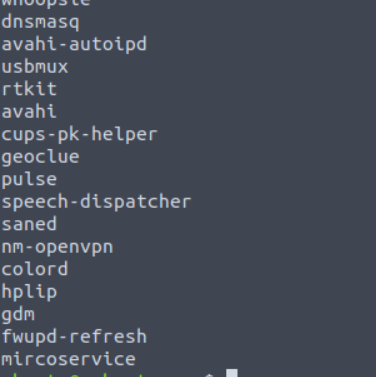

### Answer

```text
mircoservice
```

---

# Question 3

### Question

```text
What is the cronjob that was set up by the attacker for persistence?
```

### Investigation

`sudo cat /var/spool/cron/crontabs/root`

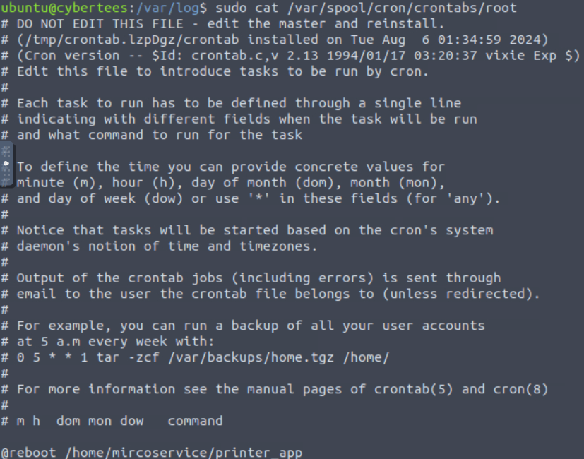

### Answer

```text
@reboot /home/mircoservice/printer_app
```

---

# Question 4

### Question

```text
Examine the running processes on the machine. Can you identify the suspicious-looking hidden process from the backdoor account?
```

### Investigation

`ps aux -u microservice`

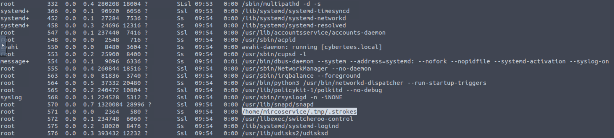

### Answer

```text
.strokes
```

---

# Question 5

### Question

```text
How many processes are found to be running from the backdoor account’s directory?
```

### Investigation

`ps aux -u microservice | grep -i home | grep -i microservice`

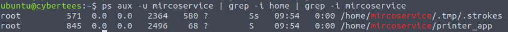

### Answer

```text
2
```

---

# Question 6

### Question

```text
What is the name of the hidden file in memory from the root directory?
```

### Investigation

`ls -la /`

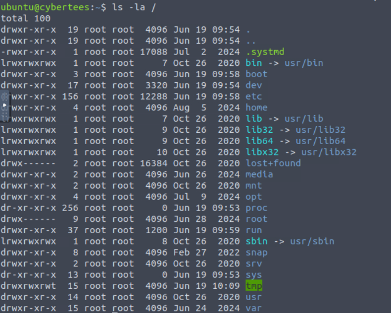

### Answer

```text
.systmd
```

---

# Question 7

### Question

```text
What suspicious services were installed on the server? Format is service a, service b in alphabetical order.
```

### Investigation

`grep -r microservice /etc/systemd/system`

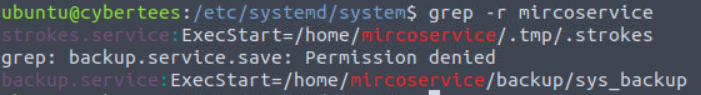

### Answer

```text
backup.service, strokes.service
```

---

# Question 8

### Question

```text
Examine the logs; when was the backdoor account created on this infected system?
```

### Investigation

`cat /var/log/auth.log | grep -a microservice`

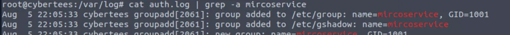

### Answer

```text
Aug 5 22:05:33
```

---

# Question 9

### Question

```text
From which IP address were multiple SSH connections observed against the suspicious backdoor account?
```

### Investigation

`cat /var/log/auth.log | grep -a microservice`

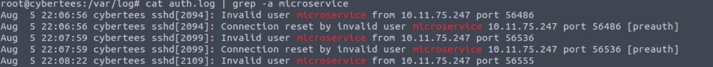

### Answer

```text
10.11.75.247
```

---

# Question 10

### Question

```text
How many failed SSH login attempts were observed on the backdoor account?
```

### Investigation

` cat /var/log/auth.log | grep -a microservice | grep -a Failed

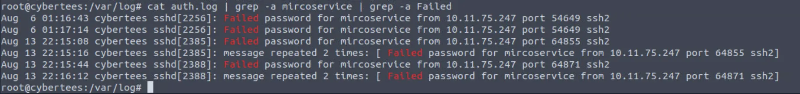

### Answer

```text
8
```

---

# Question 11

### Question

```text
Which malicious package was installed on the host?
```

### Investigation

`cat dpkg.log | grep install`

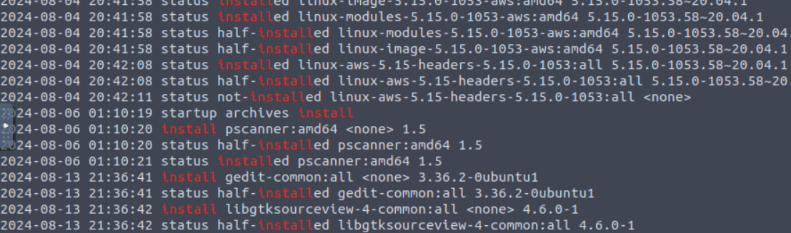

### Answer

```text
pscanner
```

---

# Question 12

### Question

```text
What is the secret code found in the metadata of the suspicious package?
```

### Investigation

`apt show pscanner`

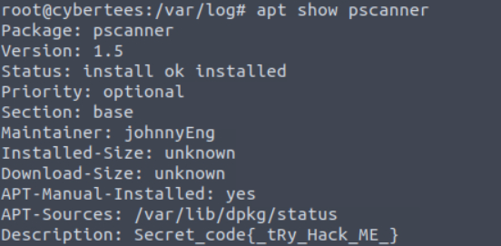


### Answer

```text
{_tRy_Hack_ME_}
```

---

# Indicators of Compromise (IOCs)

| Type              | Indicator                              |
| ----------------- | -------------------------------------- |
| User Account      | mircoservice                           |
| Cron Job          | @reboot /home/mircoservice/printer_app |
| Process           | .strokes                               |
| Hidden File       | .systmd                                |
| Service           | backup.service                         |
| Service           | strokes.service                        |
| Source IP         | 10.11.75.247                           |
| Malicious Package | pscanner                               |

---

# Persistence Mechanisms Identified

During the investigation, multiple persistence mechanisms were discovered:

* Creation of the unauthorized user account **mircoservice**
* Scheduled cron job configured to run at system startup
* Malicious systemd services
* Hidden executable processes
* Suspicious files concealed within system directories

These mechanisms ensured that the attacker could maintain access even after reboots or service interruptions.

---

# Key Takeaways

* Threat actors commonly create backdoor accounts to maintain persistence.
* Cron jobs and systemd services are frequently abused on Linux systems.
* Hidden files and processes often indicate malicious activity.
* SSH logs provide valuable evidence for identifying attacker infrastructure.
* Reviewing installed packages can uncover malware and attacker tools.
* Continuous monitoring of user creation events and persistence mechanisms is critical for detecting compromise.

---

# Conclusion

The compromise assessment successfully identified multiple indicators of attacker activity associated with the IronShade intrusion. The attacker established persistence through a backdoor account, cron jobs, malicious services, and hidden processes. Analysis of authentication logs, running processes, installed packages, and system artifacts enabled reconstruction of the attack timeline and identification of key indicators of compromise. The findings highlight the importance of monitoring user account creation, persistence mechanisms, and SSH activity within Linux environments.

