# New Hire Old Artifacts

## Scenario

You are a SOC Analyst working for **TryNotHackMe**, a Managed Security Service Provider (MSSP). A newly onboarded customer, **Widget LLC**, has recently integrated its endpoint telemetry into the managed Splunk environment.

During onboarding, Widget LLC raised concerns regarding an endpoint belonging to a recently hired Financial Analyst in the Finance Department. The customer disclosed that the endpoint protection solution was disabled for a period in **December 2021**, and no formal investigation was conducted at the time.

Your task is to analyze the available Splunk logs and determine whether any malicious activity occurred on the workstation during the period when endpoint protection was disabled.

---

## Challenge

Perform a detailed investigation of the endpoint telemetry available in Splunk and identify evidence of malicious activity, attacker actions, persistence attempts, and security control tampering.

---

# Question 1

### Question

```text
A Web Browser Password Viewer executed on the infected machine. What is the name of the binary? Enter the full path.
```

### Investigation


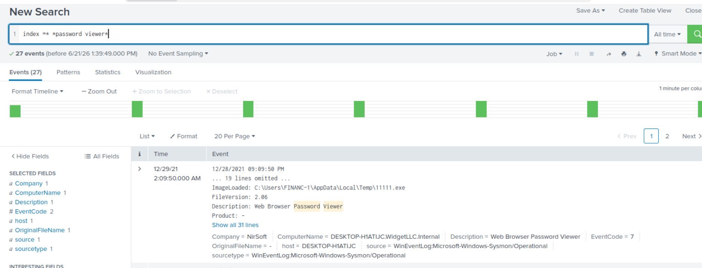

### Answer

```text
C:\Users\FINANC~1\AppData\Local\Temp\11111.exe
```

---

# Question 2

### Question

```text
What is listed as the company name?
```

### Investigation
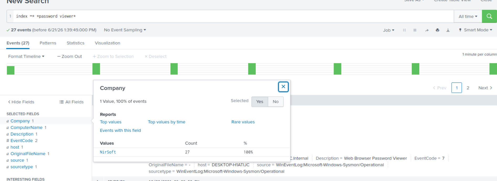

### Answer

```text
NirSoft
```

---

# Question 3

### Question

```text
Another suspicious binary running from the same folder was executed on the workstation. What was the name of the binary? What is listed as its original filename? (format: file.xyz,file.xyz)
```

### Investigation
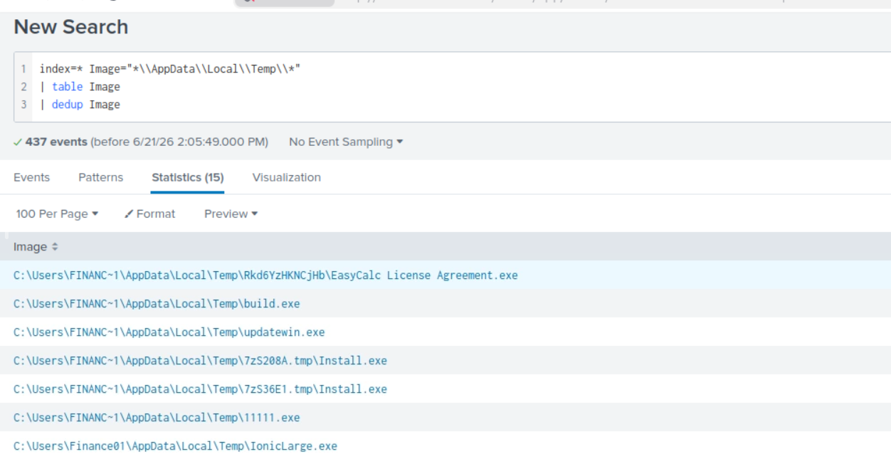

Upon finding the suspicious binary, get the hash and search it in tools like VirusTotal

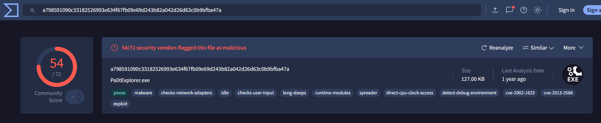

### Answer

```text
IonicLarge.exe,PalitExplorer.exe
```

---

# Question 4

### Question

```text
The binary from the previous question made two outbound connections to a malicious IP address. What was the IP address? Enter the answer in a defang format.
```

### Investigation

It was clearly mentioned in the question that only two connections have been made.

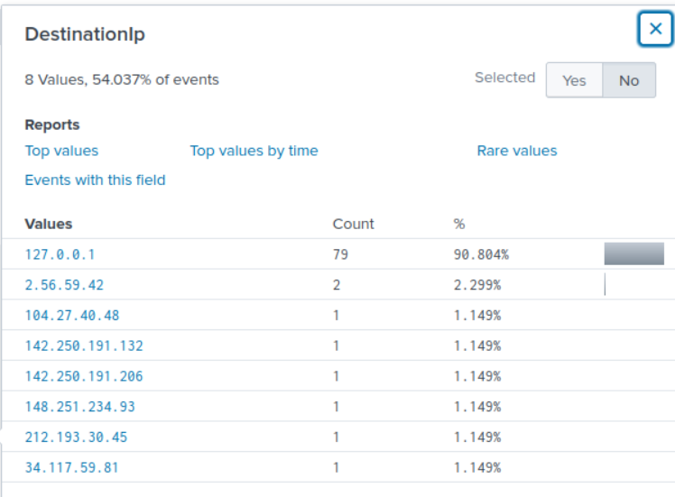

Defang the IP address


### Answer

```text
2[.]56[.]59[.]42
```

---

# Question 5

### Question

```text
The same binary made some change to a registry key. What was the key path?
```

### Investigation

Modification in registry keys is logged by Event Code 13.

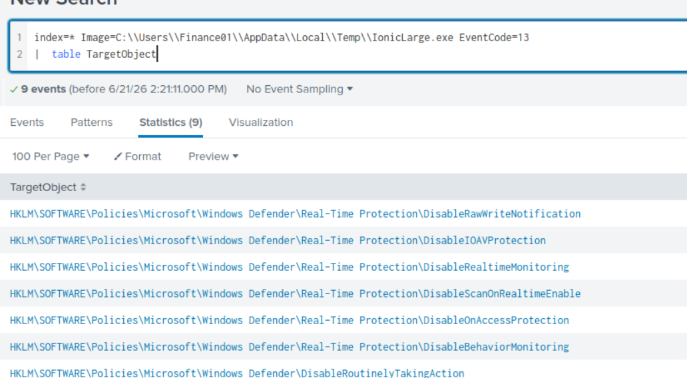

### Answer

```text
HKLM\SOFTWARE\Policies\Microsoft\Windows Defender
```

---

# Question 6

### Question

```text
Some processes were killed and the associated binaries were deleted. What were the names of the two binaries? (format: file.xyz,file.xyz)
```

### Investigation

Upon using the hint, it told to search for 'taskill /im'

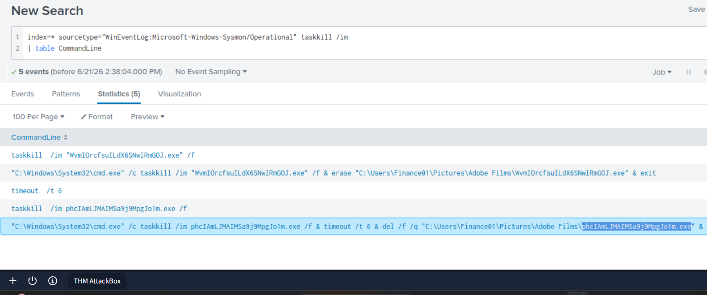

### Answer

```text
WvmIOrcfsuILdX6SNwIRmGOJ.exe,phcIAmLJMAIMSa9j9MpgJo1m.exe
```

---

# Question 7

### Question

```text
The attacker ran several commands within a PowerShell session to change the behaviour of Windows Defender. What was the last command executed in the series of similar commands?
```

### Investigation

PowerShell execution logs revealed a sequence of commands designed to modify Microsoft Defender preferences. These commands configured Defender to ignore specific malware detections by assigning custom actions to threat IDs.

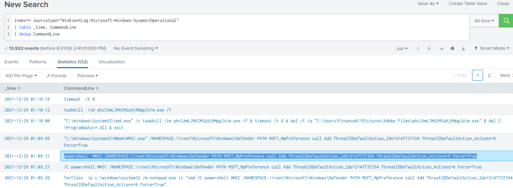

### Answer

```text
powershell WMIC /NAMESPACE:\\root\Microsoft\Windows\Defender PATH MSFT_MpPreference call Add ThreatIDDefaultAction_Ids=2147737394 ThreatIDDefaultAction_Actions=6 Force=True
```

---

# Question 8

### Question

```text
Based on the previous answer, what were the four IDs set by the attacker? Enter the answer in order of execution. (format: 1st,2nd,3rd,4th)
```

### Investigation

Reviewing the complete PowerShell command sequence revealed four distinct threat identifiers that were added to Defender's exclusion or custom action list.

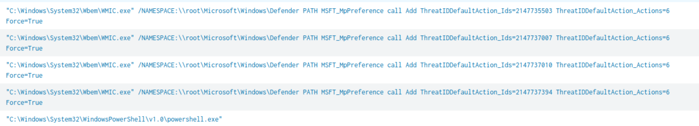

### Answer

```text
2147735503,2147737010,2147737007,2147737394
```

---

# Question 9

### Question

```text
Another malicious binary was executed on the infected workstation from another AppData location. What was the full path to the binary?
```

### Investigation

Further process analysis identified an additional executable launched from the user's Roaming profile directory. Malware commonly abuses AppData folders because they are writable by standard users and often evade scrutiny.

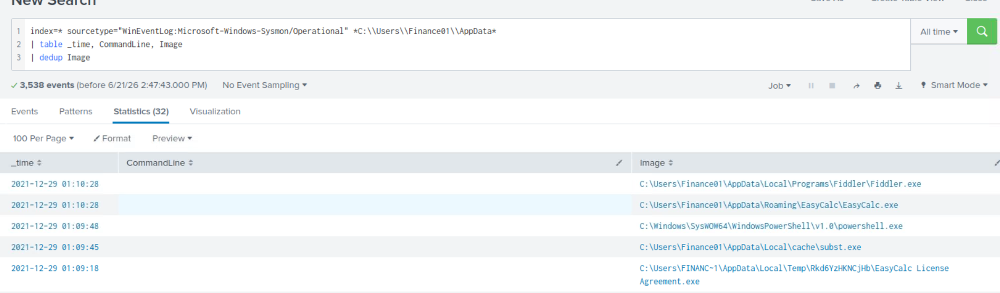

### Answer

```text
C:\Users\Finance01\AppData\Roaming\EasyCalc\EasyCalc.exe
```

---

# Question 10

### Question

```text
What were the DLLs that were loaded from the binary from the previous question? Enter the answers in alphabetical order. (format: file1.dll,file2.dll,file3.dll)
```

### Investigation

DLL load events associated with the EasyCalc process revealed multiple dynamically loaded libraries. These modules provided additional functionality to the malicious application.

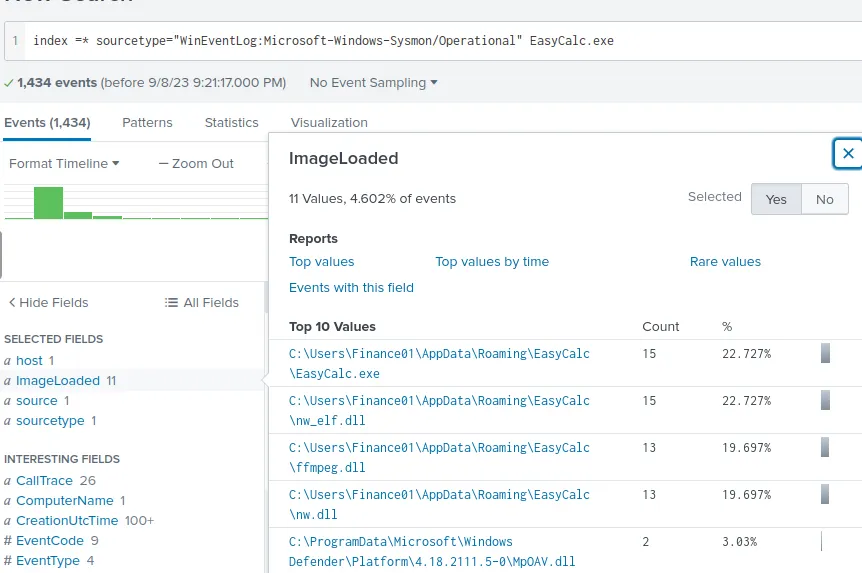

### Answer

```text
ffmpeg.dll,nw.dll,nw_elf.dll
```

---

# Indicators of Compromise (IOCs)

| Type              | Indicator                                         |
| ----------------- | ------------------------------------------------- |
| Malicious Binary  | 11111.exe                                         |
| Company Name      | NirSoft                                           |
| Suspicious Binary | IonicLarge.exe                                    |
| Original Filename | PalitExplorer.exe                                 |
| Malicious IP      | 2[.]56[.]59[.]42                                  |
| Registry Key      | HKLM\SOFTWARE\Policies\Microsoft\Windows Defender |
| Malware           | EasyCalc.exe                                      |
| DLL               | ffmpeg.dll                                        |
| DLL               | nw.dll                                            |
| DLL               | nw_elf.dll                                        |

---

# MITRE ATT&CK Mapping

| Technique | Description                      |
| --------- | -------------------------------- |
| T1555     | Credentials from Password Stores |
| T1059.001 | PowerShell                       |
| T1112     | Modify Registry                  |
| T1562.001 | Impair Defenses                  |
| T1071     | Application Layer Protocol       |
| T1105     | Ingress Tool Transfer            |
| T1070.004 | File Deletion                    |

---

# Key Findings

* A browser credential harvesting tool was executed from a temporary directory.
* The attacker used tools associated with NirSoft to obtain stored credentials.
* A suspicious executable established outbound communication with a malicious IP address.
* Windows Defender settings were modified through PowerShell and WMIC commands.
* Multiple threat IDs were configured to bypass security detections.
* Additional malware was executed from the user's Roaming profile directory.
* Evidence suggests deliberate attempts to remove artifacts through file deletion.

---

# Conclusion

The investigation confirmed that the Finance Department workstation was compromised during the period when endpoint protection was disabled. The attacker executed credential harvesting tools, modified Windows Defender settings to weaken security controls, established communication with a malicious external host, and executed additional malware from user-controlled directories. Multiple indicators of compromise were identified, and the findings should be escalated to Widget LLC along with recommendations for remediation, credential resets, endpoint reimaging, and enhanced monitoring.

