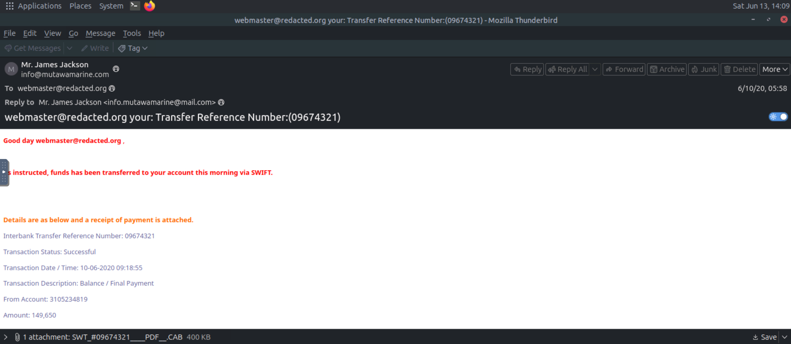
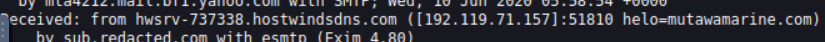
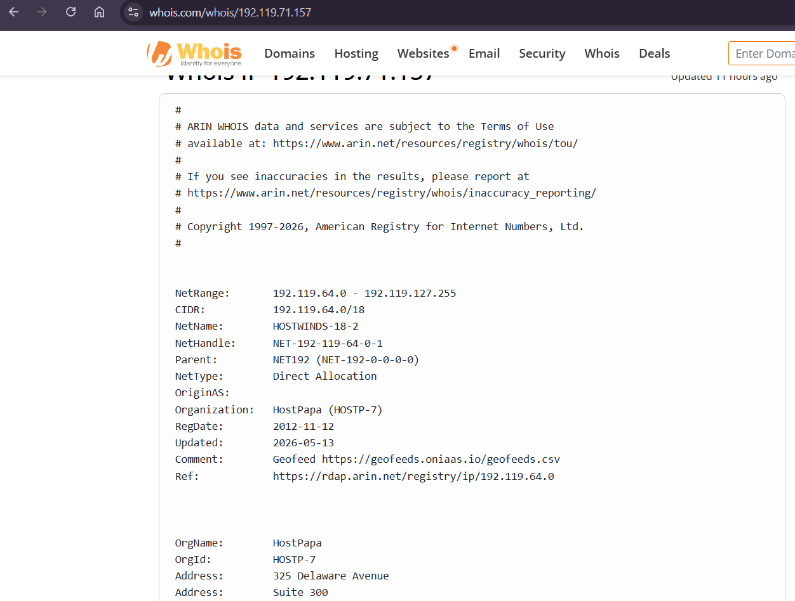
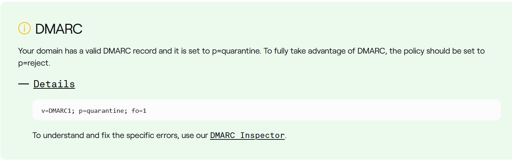
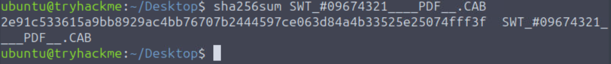

# Phishing Email Investigation

## Scenario

A sales executive at **Greenholt PLC** received a suspicious email that appeared to originate from a known customer. The email exhibited several characteristics commonly associated with phishing attacks, prompting the employee to escalate the message to the **Security Operations Center (SOC)** for further investigation.

### Observed Red Flags

- Generic greeting instead of personalized communication
- Unexpected request for a money transfer
- Unsolicited attachment included in the email
- Communication style inconsistent with the customer's normal behavior

---

## Objectives

The primary goal of this investigation is to determine whether the email is legitimate or part of a phishing campaign.

### Investigation Tasks

1. **Analyze the Email**
   - Review email headers and content.
   - Identify suspicious indicators and artifacts.

2. **Investigate the Source**
   - Determine the origin of the email.
   - Examine sender infrastructure and routing information.

3. **Verify Sender Authenticity**
   - Validate the sender's email address.
   - Check SPF, DKIM, and DMARC authentication results.

4. **Examine Attachments and Links**
   - Analyze any attached files for malicious content.
   - Inspect embedded URLs for phishing or malware activity.

5. **Assess Legitimacy**
   - Correlate findings from all investigation steps.
   - Determine whether the email is legitimate or malicious.

---

## Expected Outcome

By completing this investigation, we aim to:

- Identify indicators of compromise (IOCs).
- Understand the attacker's tactics and techniques.
- Confirm the authenticity of the sender.
- Detect malicious attachments or links.
- Provide a final verdict on the email's legitimacy.

## Methodology

The investigation followed a structured approach to identify indicators of phishing and determine whether the email was legitimate or malicious.

### 1. Initial Email Analysis

- Open the email and review its contents.
- Identify the sender and recipient email addresses.
- Examine the email body for suspicious requests or unusual behavior.
- Check for the presence of attachments and embedded URLs.

### 2. Content and Sender Verification

- Verify the spelling of email addresses and domains to detect impersonation attempts.
- Review the grammar, spelling, and professionalism of the message.
- Analyze the tone of the email for common phishing indicators such as:
  - Urgency
  - Financial requests
  - Threats
  - Special offers or rewards
- Compare the communication style with the sender's typical behavior.

### 3. Header Analysis

- Examine the email headers to determine the true source of the message.
- Extract the sender's IP address and identify its geographical location.
- Review authentication mechanisms such as SPF, DKIM, and DMARC.
- Check the reputation of the sender's IP address, domain, and URLs using threat intelligence sources.

### 4. Attachment and URL Analysis

- If an attachment is present, download it only in a controlled and isolated environment.
- Generate file hashes (MD5, SHA1, or SHA256) for identification.
- Submit the hashes to threat intelligence platforms such as:
  - VirusTotal
  - MalwareBazaar
- Perform dynamic analysis using sandbox environments such as ANY.RUN to observe file behavior.
- Inspect embedded URLs for redirects, phishing pages, or other malicious activity.

### 5. Correlation and Verdict

- Correlate findings from the email content, headers, attachments, URLs, and threat intelligence sources.
- Identify and document Indicators of Compromise (IOCs).
- Determine whether the email is legitimate or part of a phishing campaign.
- Provide a final assessment and recommended remediation actions.
  
## Investigation Findings

### Question 1
**What is the Transfer Reference Number listed in the email's Subject line?**

**Answer:** `09674321`



The transfer reference number can be found in the email subject line:
`Transfer Reference Number:(09674321)`.

---

### Question 2
**What is the display name of the sender?**

**Answer:** `Mr. James Jackson`


The display name shown in the email client is **Mr. James Jackson**.

---

### Question 3
**What is the sender's email address?**

**Answer:** `info@mutawamarine.com`


The sender address is visible directly below the display name.

---

### Question 4
**What email address will receive a reply to this email?**

**Answer:** `info.mutawamarine@mail.com`


The Reply-To address differs from the sender's address, which is a common phishing indicator.

---

### Question 5
**What is the originating IP address of this email?**

**Answer:** `192.119.71.157`



The originating IP address was identified from the email headers.

---

### Question 6
**Who is the owner of the originating IP?**

**Answer:** `HostPapa`



A WHOIS lookup on the originating IP address reveals that the IP belongs to **HostPapa**.

---

### Question 7
**What is the full SPF record for this domain?**

**Answer:**

```text
v=spf1 include:spf.protection.outlook.com -all
```

The SPF record was obtained by querying the Return-Path domain.

---

### Question 8
**What is the complete DMARC record for this domain?**

**Answer:**

```text
v=DMARC1; p=quarantine; fo=1
```



The DMARC policy is configured with `p=quarantine`, instructing mail servers to quarantine messages that fail DMARC validation.

---

### Question 9
**What is the file name of the attachment found in the email?**

**Answer:** `SWT_#09674321____PDF__.CAB`


The attachment is visible at the bottom of the email message.

---

### Question 10
**Using the sha256sum command, what is the SHA256 hash of the file?**

**Answer:**

```text
2e91c533615a9bb8929ac4bb76707b2444597ce063d84a4b33525e25074fff3f
```



The hash was generated using the `sha256sum` command.

---

### Question 11
**What is the attachment's file size in KB?**

**Answer:** `400.26 KB`

The file size was identified through VirusTotal after searching the SHA256 hash.

---

### Question 12
**What is the actual file type of the attachment?**

**Answer:** `RAR Archive`

Although the attachment uses a `.CAB` extension, analysis revealed that the actual file type is a **RAR archive**, indicating an attempt to disguise the file's true nature.

---

## Indicators of Compromise (IOCs)

### Email Addresses

```text
info@mutawamarine.com
info.mutawamarine@mail.com
```

### IP Address

```text
192.119.71.157
```

### SHA256 Hash

```text
2e91c533615a9bb8929ac4bb76707b2444597ce063d84a4b33525e25074fff3f
```

### Attachment

```text
SWT_#09674321____PDF__.CAB
```

---

## Conclusion

The investigation uncovered multiple phishing indicators:

- Generic greeting
- Unexpected financial transaction notification
- Different sender and Reply-To addresses
- Suspicious attachment
- Misleading file extension
- Potentially malicious archive file

**Verdict:** The email is **malicious** and should be classified as a phishing attempt.
