# Windows Forensics — "36 Hours of Rampage" Writeup

## Scenario

James, an HR employee at Cybertees Pvt Ltd, returned to work on Monday to find files missing and unfamiliar tools installed on his workstation. CCTV footage places a soon-to-resign employee, Johny, at James's machine over the weekend — allegedly to steal sensitive documents before joining a competitor. Johny is also believed to have deleted files and run anti-forensic tools to cover his tracks.

**Goal:** reconstruct Johny's 36-hour window of activity — files accessed, tools executed, and traces of anti-forensic behavior — using native Windows artifacts and registry forensics.

---

## Task 3 — Revisiting the Registry

The Windows Registry is a hierarchical database of OS, application, and user configuration data, physically stored as hive files under `%SystemRoot%\System32\config`.

| Hive File | Mapped Key Path | Purpose |
|---|---|---|
| SAM | `HKLM\SAM` | User accounts and local security policy |
| SECURITY | `HKLM\SECURITY` | Authentication and permissions data |
| SYSTEM | `HKLM\SYSTEM` | Hardware, drivers, startup config |
| SOFTWARE | `HKLM\SOFTWARE` | Installed software and system-wide settings |
| DEFAULT | `HKU\.DEFAULT` | Template for new user profiles |
| NTUSER.DAT | `HKCU` | Per-user preferences and settings |
| USRCLASS.DAT | `HKCU\Software\Classes` | Per-user shell/class configuration |

**Dirty hives & transaction logs:** if a hive isn't cleanly closed (e.g. abrupt shutdown), it's marked "dirty." Windows uses transaction logs (`SYSTEM.LOG1`, `SYSTEM.LOG2`, …) stored alongside the hives to roll back or replay changes and keep the registry consistent — useful forensically for spotting recent, uncommitted activity.

### Questions & Answers

**Q1. Which hive stores information about installed software?**

Answer: `SOFTWARE`

**Q2. What is the current size of the SAM hive in the attached lab? (In KB)**

Answer: `128`

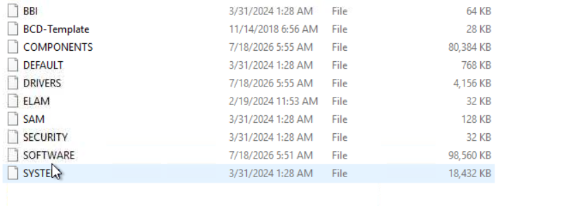
*The `config` folder listing shows `SAM` at 128 KB.*

---

## Task 4 — Performing Registry Forensics

Several `NTUSER.DAT` keys under `HKCU\Software\Microsoft\Windows\CurrentVersion\Explorer\` reveal user-driven activity in File Explorer and the Run dialog:

| Artifact | Registry Path | What it Shows |
|---|---|---|
| **TypedPaths** | `...\Explorer\TypedPaths` | Paths manually typed into the Explorer address bar / Run dialog |
| **WordWheelQuery** | `...\Explorer\WordWheelQuery` | Terms searched via Explorer's search box |
| **RecentDocs** | `...\Explorer\RecentDocs` | Recently opened documents |
| **ComDlg32 → LastVisitedMRU** | `...\Explorer\ComDlg32\LastVisitedMRU` | Recently visited folders (via Open/Save dialogs) |
| **ComDlg32 → OpenSavePidlMRU** | `...\Explorer\ComDlg32\OpenSavePidlMRU` | Recently opened/saved files and their locations |
| **UserAssist** | `...\Explorer\UserAssist` | GUI program execution counts and last-run timestamps |
| **RunMRU** | `...\Explorer\RunMRU` | Commands recently run via the Run dialog |

Two notable **UserAssist** GUIDs:
- `{CEBFF5CD-ACE2-4F4F-9178-9926F41749EA}` — Explorer file/folder interactions
- `{F4E57C4B-2036-45F0-A9AB-443BCFE33D9F}` — shortcut/`.LNK`-based program execution

### Questions & Answers

**Q1. The suspect typed a suspicious path in Windows Explorer that points to a `tmp` directory in the C drive. What is the full path?**
Answer: `C:\system\home\tmp`

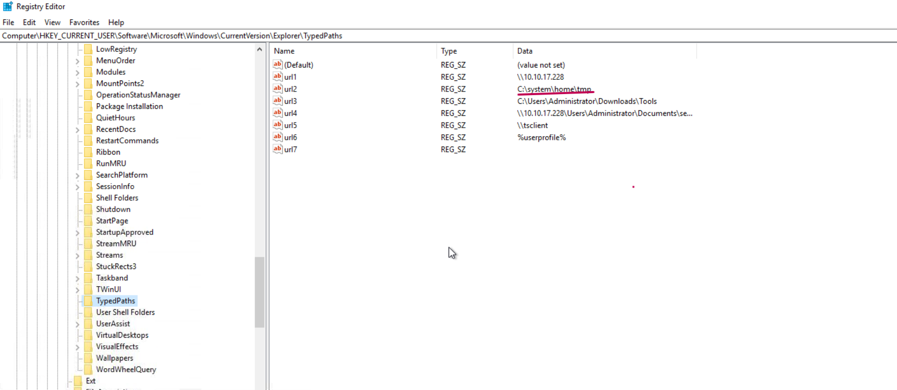


**Q2. In the WordWheelQuery search, what was the latest term searched by the user?**

Answer: `wipe`

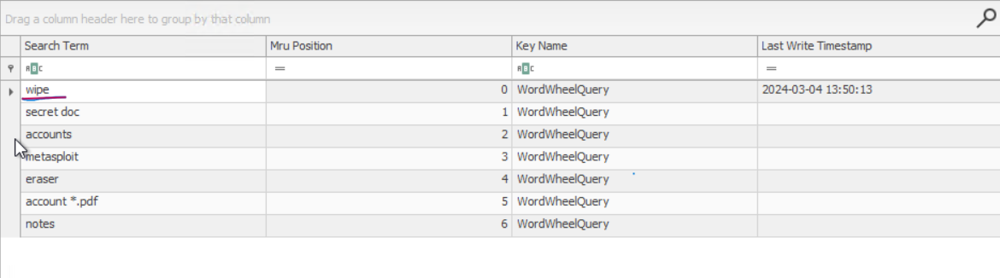


**Q3. Where was the last text file saved by the suspect?**

Answer: `C:\system\home\tmp\code.txt`

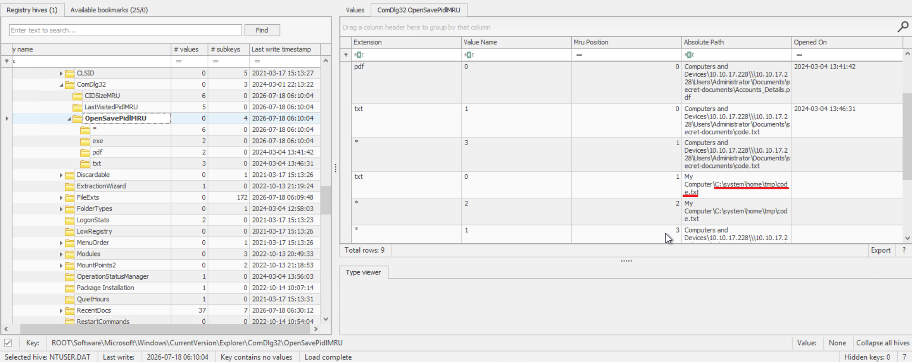


**Q4. From the Hacking-tools folder, which suspicious keylogging tool was executed 5 times?**

Answer: `keylogger.exe`

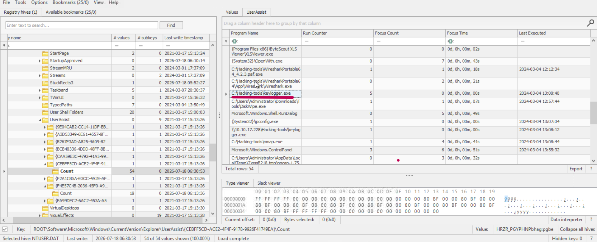


**Q5. Which disk wiping utility was executed on this host?**
Answer: `DiskWipe.exe`

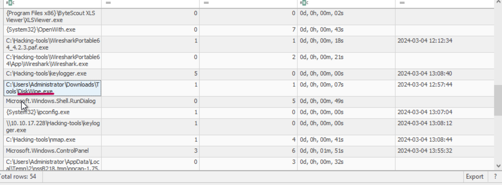


**Takeaway:** UserAssist execution counts directly tie Johny to a keylogger and a disk-wiping tool — strong evidence of both data theft and anti-forensic intent.

---

## Task 5 — ShellBags

ShellBags track how a user browsed folders (view settings, sort order, window size) — and critically, they can persist **even after the folder itself has been deleted**, making them resilient to basic cleanup attempts.

**Stored in:**
- `%USERPROFILE%\NTUSER.dat`
- `%USERPROFILE%\AppData\Local\Microsoft\Windows\UsrClass.dat`

**What ShellBags reveal:**
- Folder view settings (icons/list/details)
- Full paths of accessed directories, including network shares and removable media
- Creation/access/modification timestamps
- Traces of deleted folders
- Evidence of external drive and network share access

### Questions & Answers

**Q1. What is the IP address of the Network Share, where the user accessed three folders?**

Answer: `10.10.17.228`

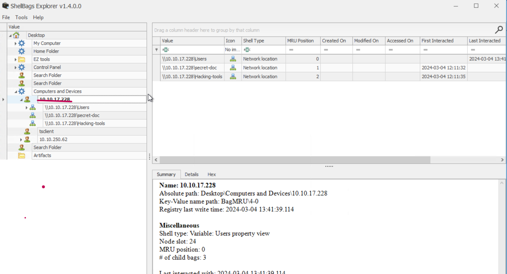


**Q2. What is the name of the second sub-folder within the Documents folder of the network share that the user accessed?**

Answer: `secret-doc`

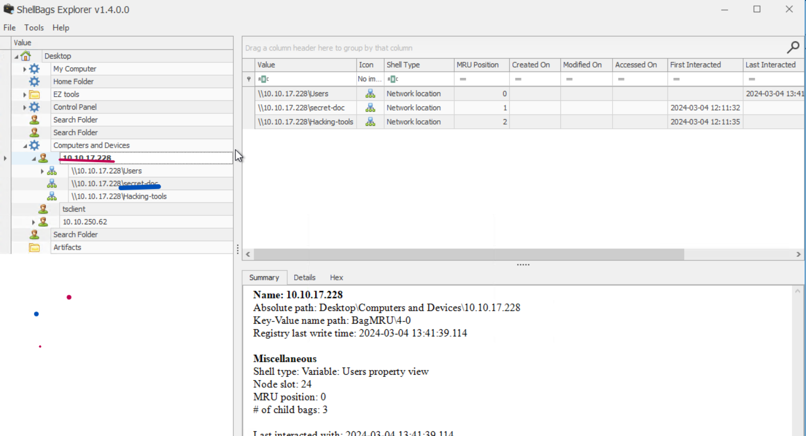


---

## Task 6 — LNK Files

### LNK (Shortcut) Files
Windows auto-generates a `.lnk` file whenever a user opens a file or application. These shortcuts record the accessed file's name, timestamp, target path, source (local disk vs. network share), and file size.

**Default locations:**
- `%userprofile%\AppData\Roaming\Microsoft\Windows\Recent`
- `%userprofile%\Recent`

**Tool used:** `LECmd.exe` (Eric Zimmerman's LNK parser)

```
LECmd.exe -f C:\Users\Administrator\AppData\Roaming\Microsoft\Windows\Recent\code.lnk
```
### Question and answers

** Q1. What is the document that was last opened by the user on this machine? **

Answer: `10_ways_to_Exfiltrate_Data.pdf`

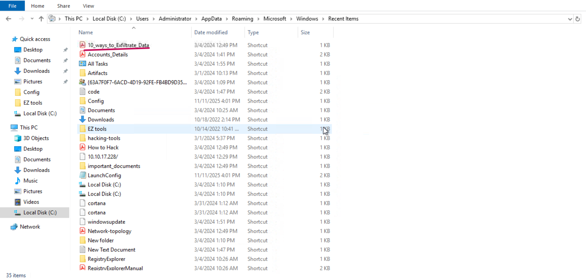

** Q2. Analyzing the code.lnk file shows that it was accessed from the network shared drive. What is the full path of the network directory? **

Answer: `\\10.10.17.228\Users\Administrator\Documents\secret-documents`

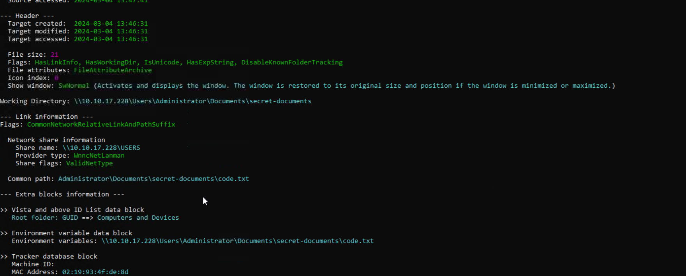


---

## Task 7 — Jump Lists

Jump Lists track frequently used files, apps, and sites, surfaced via the Taskbar/Start Menu. They come in two flavors:
- **AutomaticDestinations** — auto-populated per application
- **CustomDestinations** — manually added entries by an app

**Location:**
- `%APPDATA%\Microsoft\Windows\Recent\AutomaticDestinations`
- `%APPDATA%\Microsoft\Windows\Recent\CustomDestinations`

Combined with LNK analysis, Jump Lists exposed which sensitive files (including PDFs) Johny opened, from where, how often, and when.

### Questions & Answers

**Q1. A text file named `code.txt` was accessed from a `tmp` directory. What is the full path of the `tmp` directory?**

Answer: `C:\system\home\tmp\code.txt`

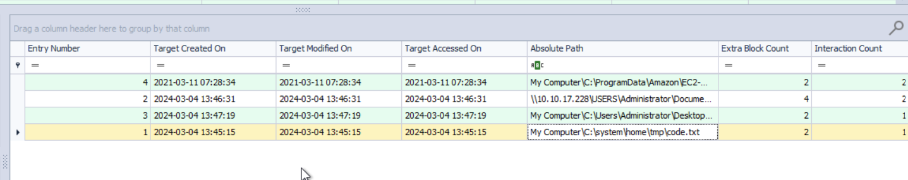


**Q2. What URL was accessed using Internet Explorer?**

Answer: `http://10.10.17.228/`


**Q3. When did the user access the "How to Hack.pdf" file?**

Answer: `2024-03-04 12:28:26`

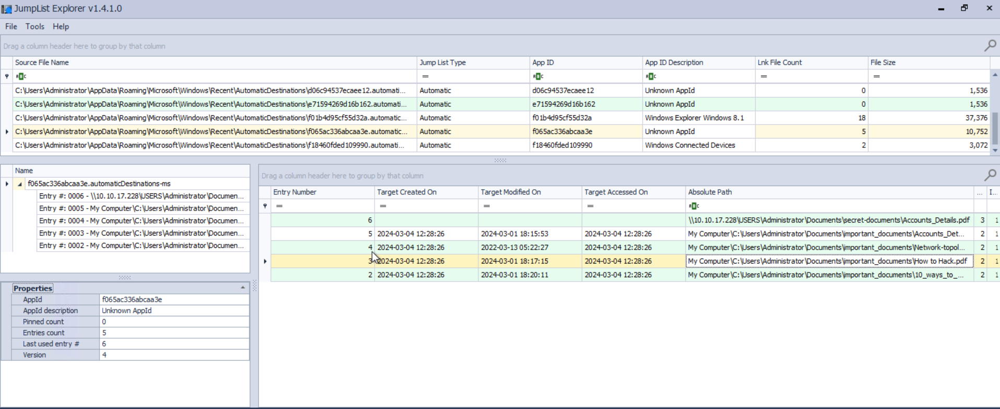


---

## Investigation Summary

Piecing the artifacts together, Johny's activity over the 36-hour window included:

1. **Reconnaissance** — searching for and browsing sensitive folders via Explorer (TypedPaths, WordWheelQuery, ShellBags), including a network share at `10.10.17.228` containing a `secret-doc` folder.
2. **Data staging** — working out of a local `C:\system\home\tmp` directory, saving/editing `code.txt`.
3. **Malicious tooling** — executing `keylogger.exe` (5 times) from a `Hacking-tools` folder, per UserAssist.
4. **Research/intent** — opening "How to Hack.pdf," and accessing an external URL over HTTP.
5. **Anti-forensics** — running `DiskWipe.exe` to attempt to destroy evidence, though registry, ShellBag, LNK, and Jump List artifacts survived and reconstructed the timeline regardless.

**Key forensic lesson:** even deliberate cleanup (deleting files, wiping disks) leaves a footprint across multiple redundant Windows artifacts — registry MRU keys, ShellBags, LNK files, and Jump Lists — because each is generated and stored independently by different OS subsystems.

---

*Tools referenced: LECmd.exe (Eric Zimmerman's EZ Tools suite).*
